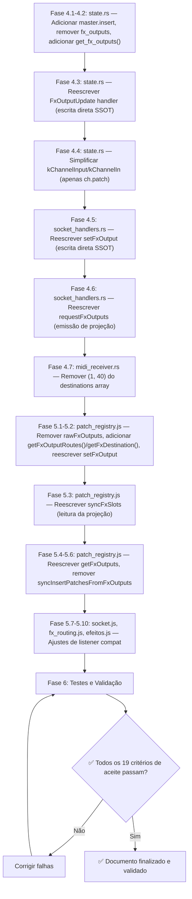

# Plano de Correção Arquitetural: Patch Routing — Single Source of Truth (SSOT)

> **Status**: ✅ **CONCLUÍDO**
> **Prioridade**: 🔴 CRÍTICA
> **Módulos Afetados**: `server_rust/src/state.rs`, `server_rust/src/midi_receiver.rs`, `server_rust/src/midi/protocol.rs`, `server_rust/src/socket_handlers.rs`, `public_new/modules/services/patch_registry.js`, `public_new/modules/services/socket.js`, `public_new/modules/FXS/fx_routing.js`, `public_new/modules/FXS/efeitos.js`

---

## 1. Cabeçalho / Metadados

| Campo | Valor |
|---|---|
| **Documento** | `docs/plano_de_correcao_source_of_truth_patch_routing.md` |
| **Status** | ✅ CONCLUÍDO |
| **Prioridade** | 🔴 CRÍTICA |
| **Objetivo** | Estabelecer **SSOT PURA** (Single Source of Truth) para todos os patches de FX output. Eliminação total do estado paralelo (`fx_outputs` / `rawFxOutputs`). Os cinco campos de patch são a única fonte de verdade; tudo mais é projeção derivada. |
| **Arquitetura** | Zero estado paralelo. Zero glue code if/else. Projeção pura. |

---

## 2. Diagnóstico e Anti-Pattern

### 2.1. Problema 1: Flash de Patch no Alt-Tab

**Causa raiz**: O mapa `fx_outputs` (backend) e `rawFxOutputs` (frontend) são **estados paralelos** que espelham parcialmente os campos de patch. No ciclo de reconexão WebSocket:

1. `connect` dispara `requestFxOutputs()` → o servidor devolve `state.fx_outputs` com dados de **boot** (estado da última sincronia física, pode estar obsoleto).
2. `fxOutputsUpdate` chega ao frontend → `PatchRegistry.setFxOutput()` chama `setInputPatch(channel, sv)` para `element === 1`.
3. Se `sv` é `0` (NONE) ou um valor de patch físico (ex: `3` = AD 3), isso **sobrescreve** `channelStates[ch].patch` com um valor que **não é FX**.
4. `sync` chega **depois** corrigindo o valor — mas o flash de ~50ms já ocorreu.

### 2.2. Problema 2: Estado Paralelo (Anti-Pattern)

```
ANTI-PATTERN — ESTADO PARALELO (REJEITADO)
═══════════════════════════════════════════════════════════════

  Frontend                        Backend
  ┌─────────────────────┐        ┌─────────────────────┐
  │ rawFxOutputs[destKey]│◄──────►│ state.fx_outputs    │
  │  (espelho paralelo) │        │  (espelho paralelo) │
  └─────────────────────┘        └─────────────────────┘
         │                              │
         │ setFxOutput()                │ FxOutputUpdate (MIDI)
         │                              │
         ▼                              ▼
  ┌─────────────────────┐        ┌─────────────────────┐
  │ channelStates[ch].patch │  │ state.channels[ch].patch│
  │  (SSOT candidato)   │        │  (SSOT oficial)    │
  └─────────────────────┘        └─────────────────────┘
         │                              │
         │❌ DESINCRONIZAÇÃO:        │❌ DESINCRONIZAÇÃO:
         │ quando kChannelInput      │ quando kChannelInput
         │ muda patch → AD 5,       │ muda patch → AD 5,
         │ fx_outputs NÃO remove     │ fx_outputs NÃO remove
         │ a entrada element=1        │ a entrada element=1
         │                           │
  ❌ Na reconexão, requestFxOutputs devolve o valor FX OBSOLETO
  ❌ setFxOutput sobrescreve o patch físico com um valor FX
```

### 2.3. Problema 3: Tempestade MIDI (Element 1)

No `midi_receiver.rs`, o array de destinations inclui `(1, 40)` — requisita `FxOutputUpdate` para todos os 40 canais/elemento 1. Isso é **redundante**: o patch de entrada do canal (`channels[ch].patch`) já é atualizado pelo handler autoritativo `kChannelInput/kChannelIn`. Durante transições de patch (ex: Alt-Tab), isso gera 40 requisições MIDI espúrias saturando a fila.

### 2.4. Problema 4: Blindagem de MasterState

O `MasterState` atualmente **não possui** campo `insert.patch_in`. O diretivo arquitetural lista `master.insert.patch_in` (element 10) como uma das cinco SSOTs. Esta seção exige a adição do campo `insert: InsertState` ao `MasterState` para que o elemento 10 (MASTER) tenha um patch de insert autoritativo, eliminando a necessidade do paralelo `fx_outputs[1000+ch]`.

### 2.5. Problema 5: syncInsertPatchesFromFxOutputs — Blindagem Inversa

A função `syncInsertPatchesFromFxOutputs()` (patch_registry.js, linha 564) **sobrescreve cegamente** `insert.patch_in` de canais/buses/aux a partir de `rawFxOutputs`. Em uma arquitetura SSOT-pura, `insert.patch_in` já é a fonte de verdade — não deve ser sobrescrita. A função deve ser removida.

---

## 3. Fundamentação Teórica e Regras de SSOT Pura

### 3.1. Definição de SSOT Pura

> **Zero Estado Paralelo**: Não existe nenhum mapa, cache ou variável que duplique informação já contida nos campos SSOT. Se um dado pode ser derivado, ele **não** é armazenado.

### 3.2. As Cinco Fontes de Verdade (SSOT)

| # | Campo SSOT | Elemento MIDI | Domínio | Descrição |
|---|---|---|---|---|
| 1 | `channels[0..39].patch` | 1 (CH/STIN) | Channel Input Patch | Patch de entrada de canais 1-32 + ST IN 1-4 (L/R). Valores FX: 121-140. |
| 2 | `channels[0..31].insert.patch_in` | 2 (Insert CH) | Channel Insert Patch | Patch IN do insert de canais 1-32. |
| 3 | `buses[0..7].insert.patch_in` | 7 (Insert BUS) | Bus Insert Patch | Patch IN do insert de buses 1-8. |
| 4 | `mixes[0..7].insert.patch_in` | 8 (Insert AUX) | Aux Insert Patch | Patch IN do insert de auxiliares 1-8. |
| 5 | `master.insert.patch_in` | 10 (MASTER) | Master Insert Patch | Patch IN do insert stereo do master. |

### 3.3. Regra da Projeção (Projection Rule)

> **FX Outputs são PROJEÇÃO, não ESTADO**: Qualquer consulta "qual slotFX está routado para onde?" deve **computar a resposta varrendo os cinco campos SSOT em tempo real**. Não há cache, não há espelho, não há sincronização.

### 3.4. Regra de Escrita Direta (Direct Write Rule)

> **setFxOutput escreve direto no SSOT**: Quando `setFxOutput(slot, lr, element, dest_channel)` é chamado, o backend **escreve diretamente** no campo SSOT correspondente (`channels[ch].patch` para element=1, `channels[ch].insert.patch_in` para element=2, etc.). Não há escrita em `fx_outputs`.

### 3.5. Regra de Sincronização (Sync Rule)

> **O evento `sync` é autoritativo**: No evento de reconexão, `syncFromGlobalState()` propaga o estado GlobalState (que contém os cinco campos SSOT) para o frontend. Não há necessidade de `requestFxOutputs` separado — os campos SSOT já carregam a informação.

### 3.6. Regra de Re-query (Re-query Rule)

> **Element 1 é removido do re-query MIDI**: Como `channels[ch].patch` é atualizado autoritariamente pelo handler `kChannelInput/kChannelIn`, requisitar `FxOutputUpdate` para elemento 1 é redundante e causa tempestade MIDI. Os elementos 2, 7, 8, 10 permanecem.

---

## 4. Fase 1: Backend Rust (Eliminação do Estado Paralelo)

### 4.1. `server_rust/src/state.rs` — Remoção de `fx_outputs`

**Ação**: Remover o campo `fx_outputs` do struct `GlobalState` e adicionar o campo `insert` ao `MasterState`.

```rust
// MasterState — ANTES (não tem insert)
#[derive(Debug, Clone, Serialize, Deserialize)]
pub struct MasterState {
    pub value: f64,
    pub on: bool,
    pub solo: bool,
    pub att: f64,
    pub pan: f64,
    pub name: String,
    #[serde(rename = "nameChars")]
    pub name_chars: Vec<String>,
    pub comp: CompState,
    pub eq: EqState,
}

// MasterState — DEPOIS (SSOT completa — campo insert adicionado)
#[derive(Debug, Clone, Serialize, Deserialize)]
pub struct MasterState {
    pub value: f64,
    pub on: bool,
    pub solo: bool,
    pub att: f64,
    pub pan: f64,
    pub name: String,
    #[serde(rename = "nameChars")]
    pub name_chars: Vec<String>,
    pub comp: CompState,
    pub eq: EqState,
    pub insert: InsertState,  // ✅ SSOT #5 — elemento 10 (MASTER)
}
```

Remover do `GlobalState`:

```rust
// REMOVER ESTAS LINES do GlobalState:
// #[serde(rename = "fxOutputs")]
// pub fx_outputs: HashMap<usize, f64>,

// E no GlobalState::new(), remover:
// fx_outputs: HashMap::new(),
```

### 4.2. `server_rust/src/state.rs` — Adicionar Método de Projeção `get_fx_outputs()`

```rust
impl GlobalState {
    /// PROJEÇÃO PURA — não é estado. Computa FX output routes varrendo os 5 campos SSOT.
    /// Retorna: { destKey: slotVal } onde destKey = element*100 + channel, slotVal ∈ {121..140}
    pub fn get_fx_outputs(&self) -> std::collections::HashMap<usize, f64> {
        let mut routes = std::collections::HashMap::new();

        // Element 1: channels[0..39].patch — se o patch é um FX (121..140),
        // registra a rota: destKey = 1*100 + channel → slotVal
        for (ch_idx, ch_state) in &self.channels {
            if *ch_idx < 40 {
                let patch_rounded = ch_state.patch.round() as u32;
                if (121..=140).contains(&patch_rounded) {
                    let key = 1 * 100 + ch_idx;
                    routes.insert(key, ch_state.patch);
                }
            }
        }

        // Element 2: channels[0..31].insert.patch_in — se FX, registra rota
        for (ch_idx, ch_state) in &self.channels {
            if *ch_idx < 32 {
                let patch_rounded = ch_state.insert.patch_in.round() as u32;
                if (121..=140).contains(&patch_rounded) {
                    let key = 2 * 100 + ch_idx;
                    routes.insert(key, ch_state.insert.patch_in);
                }
            }
        }

        // Element 7: buses[0..7].insert.patch_in
        for (bus_idx, bus_state) in &self.buses {
            if *bus_idx < 8 {
                let patch_rounded = bus_state.insert.patch_in.round() as u32;
                if (121..=140).contains(&patch_rounded) {
                    let key = 7 * 100 + bus_idx;
                    routes.insert(key, bus_state.insert.patch_in);
                }
            }
        }

        // Element 8: mixes[0..7].insert.patch_in
        for (mix_idx, mix_state) in &self.mixes {
            if *mix_idx < 8 {
                let patch_rounded = mix_state.insert.patch_in.round() as u32;
                if (121..=140).contains(&patch_rounded) {
                    let key = 8 * 100 + mix_idx;
                    routes.insert(key, mix_state.insert.patch_in);
                }
            }
        }

        // Element 10: master.insert.patch_in
        let master_patch_rounded = self.master.insert.patch_in.round() as u32;
        if (121..=140).contains(&master_patch_rounded) {
            let key = 10 * 100 + 0;
            routes.insert(key, self.master.insert.patch_in);
        }

        routes
    }
}
```

### 4.3. `server_rust/src/state.rs` — Handler `FxOutputUpdate` (Escrita Direta no SSOT)

```rust
crate::midi::protocol::ParsedMidi::FxOutputUpdate {
    element,
    channel,
    value,
} => {
    // ✅ SSOT PURA: escreve diretamente nos campos autoritativos.
    // NÃO existe másState.fx_outputs para atualizar.
    let rounded = (*value).round() as u32;
    let is_fx = (121..=140).contains(&rounded);

    if *element == 1 {
        // SSOT #1: channels[ch].patch
        if let Some(ch) = self.channels.get_mut(channel) {
            if is_fx {
                ch.patch = *value;
            }
            // Se não é FX (NONE ou patch físico), channels[ch].patch é atualizado
            // pelo handler kChannelInput/kChannelIn — não tocamos aqui.
        }
    } else if *element == 2 {
        // SSOT #2: channels[ch].insert.patch_in
        if let Some(ch) = self.channels.get_mut(channel) {
            if is_fx {
                ch.insert.patch_in = *value;
            }
        }
    } else if *element == 7 {
        // SSOT #3: buses[ch].insert.patch_in
        if let Some(bus) = self.buses.get_mut(channel) {
            if is_fx {
                bus.insert.patch_in = *value;
            }
        }
    } else if *element == 8 {
        // SSOT #4: mixes[ch].insert.patch_in
        if let Some(aux) = self.mixes.get_mut(channel) {
            if is_fx {
                aux.insert.patch_in = *value;
            }
        }
    } else if *element == 10 {
        // SSOT #5: master.insert.patch_in (requer campo insert adicionado ao MasterState)
        if is_fx {
            self.master.insert.patch_in = *value;
        }
    }
}
```

### 4.4. `server_rust/src/state.rs` — Handler `kChannelInput/kChannelIn` (SSOT Autoritativo)

```rust
} else if mt == "kChannelInput/kChannelIn" {
    if let Some(ch) = self.channels.get_mut(channel) {
        ch.patch = v;  // ✅ SSOT #1 — ESTA é a única escrita para channel patch
    }
}
```

> **Nota**: Não há sincronização de `fx_outputs` aqui — ele não existe mais. A projeção `get_fx_outputs()` computa a rota em tempo real varrendo `channels[ch].patch`.

### 4.5. `server_rust/src/socket_handlers.rs` — Handler `setFxOutput` (Escrita Direta no SSOT)

```rust
// Step 2: Set the new destination locally (optimistic update)
if let (Some(el), Some(ch)) = (element, dest_channel) {
    // ✅ SSOT PURA: escreve diretamente no campo autoritativo.
    // NÃO existe mais state.fx_outputs para atualizar.
    match el {
        1 => {
            // SSOT #1: channels[ch].patch
            if ch < 40 {
                if let Some(channel_state) = state.channels.get_mut(&ch) {
                    channel_state.patch = fx_slot_val as f64;
                }
            }
        }
        2 => {
            // SSOT #2: channels[ch].insert.patch_in
            if ch < 32 {
                if let Some(channel_state) = state.channels.get_mut(&ch) {
                    channel_state.insert.patch_in = fx_slot_val as f64;
                }
            }
        }
        7 => {
            // SSOT #3: buses[ch].insert.patch_in
            if ch < 8 {
                if let Some(bus_state) = state.buses.get_mut(&ch) {
                    bus_state.insert.patch_in = fx_slot_val as f64;
                }
            }
        }
        8 => {
            // SSOT #4: mixes[ch].insert.patch_in
            if ch < 8 {
                if let Some(mix_state) = state.mixes.get_mut(&ch) {
                    mix_state.insert.patch_in = fx_slot_val as f64;
                }
            }
        }
        10 => {
            // SSOT #5: master.insert.patch_in
            self.master.insert.patch_in = fx_slot_val as f64;
        }
        _ => {}
    }
}

// ... send MIDI packets as before ...

// Emitir projeção para todos os clientes
let fx_out_json = serde_json::to_value(state.get_fx_outputs()).unwrap_or_default();
let _ = io_fx_out.emit("fxOutputsUpdate", &fx_out_json).await;
```

### 4.6. `server_rust/src/socket_handlers.rs` — Handler `requestFxOutputs` (Projeção)

```rust
// --- REQUEST FX OUTPUTS (agora é PROJEÇÃO, não estado) ---
let state_fx_out = global_state_socket.clone();
socket.on(
    "requestFxOutputs",
    move |socket: SocketRef| async move {
        let state = state_fx_out.read().await;
        // ✅ PROJEÇÃO PURA: get_fx_outputs() varre os 5 campos SSOT
        let fx_out_json = serde_json::to_value(state.get_fx_outputs()).unwrap_or_default();
        socket.emit("fxOutputsUpdate", &fx_out_json).ok();
    },
);
```

### 4.7. `server_rust/src/midi_receiver.rs` — Remoção do Element 1 do Re-query

```rust
// R5: Element 1 (CH/STIN) é REMOVIDO do re-query.
// channels[ch].patch já é atualizado autoritariamente pelo handler
// kChannelInput/kChannelIn no state.rs. Requisitar FxOutputUpdate para
// elemento 1 é redundante, causa tempestade MIDI e não é mais necessário
// porque fx_outputs é projeção — não estado.
let destinations: &[(u8, u8)] = &[
    (2, 32),   // Insert CH (element 2)
    (7, 8),    // Insert BUS (element 7)
    (8, 8),    // Insert AUX (element 8)
    // (1, 40) REMOVIDO — SSOT: channels[ch].patch é atualizado via kChannelInput
    (10, 1),   // MASTER (element 10) — requer inserto no MasterState
];
```

### 4.8. Passos de Implementação — Backend

1. Adicionar `pub insert: InsertState` ao `MasterState` em `state.rs`.
2. Inicializar `master.insert` em `GlobalState::new()`.
3. Remover `fx_outputs: HashMap<usize, f64>` do `GlobalState` struct.
4. Remover `fx_outputs: HashMap::new()` da inicialização em `GlobalState::new()`.
5. Adicionar método `get_fx_outputs()` como projeção pura (seção 4.2).
6. Reescrever o handler `FxOutputUpdate` (seção 4.3) — escrita direta nos 5 SSOTs.
7. Simplificar o handler `kChannelInput/kChannelIn` (seção 4.4) — apenas escreve `ch.patch`.
8. Reescrever o handler `setFxOutput` em `socket_handlers.rs` (seção 4.5) — escrita direta nos SSOTs.
9. Reescrever o handler `requestFxOutputs` (seção 4.6) — emitir projeção via `get_fx_outputs()`.
10. Remover `(1, 40)` do array `destinations` em `midi_receiver.rs` (seção 4.7).
11. `cargo check` e `cargo test`.

---

## 5. Fase 2: Frontend (Eliminação do Estado Paralelo)

### 5.1. `public_new/modules/services/patch_registry.js` — Remoção de `rawFxOutputs`

**Remover:**

```javascript
// REMOVER:
const rawFxOutputs = {};
```

**Adicionar método de projeção pura:**

```javascript
/**
 * PROJEÇÃO PURA — não é estado. Computa FX output routes varrendo
 * channelStates[ch].patch, insert.patch_in, busesState, mixesState, master.
 * Retorna: { destKey: slotVal }
 */
function getFxOutputRoutes() {
    var routes = {};
    var cs = window.channelStates || (typeof channelStates !== 'undefined' ? channelStates : null);
    if (cs) {
        // Element 1: channels[ch].patch
        for (var ch = 0; ch < 40; ch++) {
            if (cs[ch] && cs[ch].patch !== undefined) {
                var v = Math.round(cs[ch].patch);
                if (v >= 121 && v <= 140) {
                    routes[1 * 100 + ch] = v;
                }
            }
        }
        // Element 2: channels[ch].insert.patch_in
        for (var ch2 = 0; ch2 < 32; ch2++) {
            if (cs[ch2] && cs[ch2].insert && cs[ch2].insert.patch_in !== undefined) {
                var v2 = Math.round(cs[ch2].insert.patch_in);
                if (v2 >= 121 && v2 <= 140) {
                    routes[2 * 100 + ch2] = v2;
                }
            }
        }
    }
    // Element 7: busesState[b].insert.patch_in
    var bs = window.busesState || (typeof busesState !== 'undefined' ? busesState : null);
    if (bs) {
        for (var b = 0; b < 8; b++) {
            if (bs[b] && bs[b].insert && bs[b].insert.patch_in !== undefined) {
                var vb = Math.round(bs[b].insert.patch_in);
                if (vb >= 121 && vb <= 140) {
                    routes[7 * 100 + b] = vb;
                }
            }
        }
    }
    // Element 8: mixesState[m].insert.patch_in
    var ms = window.mixesState || (typeof mixesState !== 'undefined' ? mixesState : null);
    if (ms) {
        for (var m = 0; m < 8; m++) {
            if (ms[m] && ms[m].insert && ms[m].insert.patch_in !== undefined) {
                var vm = Math.round(ms[m].insert.patch_in);
                if (vm >= 121 && vm <= 140) {
                    routes[8 * 100 + m] = vm;
                }
            }
        }
    }
    // Element 10: master.insert.patch_in
    if (window.masterState && window.masterState.insert && window.masterState.insert.patch_in !== undefined) {
        var vmst = Math.round(window.masterState.insert.patch_in);
        if (vmst >= 121 && vmst <= 140) {
            routes[10 * 100 + 0] = vmst;
        }
    }
    return routes;
}

/**
 * Retorna o destino FX para um slot+lr específico.
 * Slot 0=FX1, 1=FX2, 2=FX3, 3=FX4; lr 0=L, 1=R.
 * FX slot values: FX1=121/122, FX2=129/130, FX3=137/138, FX4=139/140
 */
function getFxDestination(slot, lr) {
    var slotVals = [
        [121, 122], [129, 130], [137, 138], [139, 140]
    ];
    if (slot < 0 || slot > 3 || lr < 0 || lr > 1) return null;
    var targetVal = slotVals[slot][lr];
    var routes = getFxOutputRoutes();
    for (var key in routes) {
        if (routes.hasOwnProperty(key) && Math.round(routes[key]) === targetVal) {
            return parseInt(key, 10);
        }
    }
    return null;  // OFF — não encontrado
}
```

### 5.2. `public_new/modules/services/patch_registry.js` — Reescrita de `setFxOutput`

```javascript
/**
 * ✅ SSOT PURA: setFxOutput escreve DIRETAMENTE nos campos autoritativos.
 * NÃO existe rawFxOutputs — a projeção é computada via getFxOutputRoutes().
 */
function setFxOutput(destKey, slotVal) {
    var sv = Math.round(slotVal);
    var element = Math.floor(destKey / 100);
    var channel = destKey % 100;
    var is_fx = (sv >= 121 && sv <= 140);

    // Só escrevemos se o valor for um FX válido (121..140).
    // Valores NONE (0) ou físicos são ignorados — o patch físico
    // já vem atualizado via kChannelInput/kChannelIn no sync.
    if (!is_fx) return;

    if (element === 1 && channel >= 0 && channel < 40) {
        // SSOT #1: channels[ch].patch
        setInputPatch(channel, sv);  // setInputPatch atualiza channelStates[ch].patch + inputs[ch]
    } else if (element === 2 && channel >= 0 && channel < 32) {
        // SSOT #2: channels[ch].insert.patch_in
        var chData = typeof getChannelStateById === 'function'
            ? getChannelStateById(channel)
            : (window.channelStates && window.channelStates[channel]);
        if (chData) {
            chData.insert.patch_in = sv;
            syncSingleInsert(channel, chData);
        }
        if (typeof window.rerenderOpenInsertModal === 'function') window.rerenderOpenInsertModal(channel);
    } else if (element === 7 && channel >= 0 && channel < 8) {
        // SSOT #3: busesState[channel].insert.patch_in
        var busData = window.busesState && window.busesState[channel];
        if (busData) {
            busData.insert.patch_in = sv;
            syncSingleInsert(44 + channel, busData);
        }
        if (typeof window.rerenderOpenInsertModal === 'function') window.rerenderOpenInsertModal(44 + channel);
    } else if (element === 8 && channel >= 0 && channel < 8) {
        // SSOT #4: mixesState[channel].insert.patch_in
        var auxData = window.mixesState && window.mixesState[channel];
        if (auxData) {
            auxData.insert.patch_in = sv;
            syncSingleInsert(36 + channel, auxData);
        }
        if (typeof window.rerenderOpenInsertModal === 'function') window.rerenderOpenInsertModal(36 + channel);
    } else if (element === 10 && channel === 0) {
        // SSOT #5: master.insert.patch_in
        if (window.masterState) {
            window.masterState.insert.patch_in = sv;
            syncSingleInsert(52, { insert: window.masterState.insert });
        }
    }

    // Recalcula slots de FX via projeção pura
    syncFxSlots();
    if (typeof window.renderRoutingOverview === 'function') window.renderRoutingOverview();
}
```

### 5.3. `public_new/modules/services/patch_registry.js` — Reescrita de `syncFxSlots`

```javascript
function syncFxSlots() {
    // FX Inputs — lê diretamente do cache raw (rawFxInputs permanece, é SSOT para FX inputs)
    for (var s = 0; s < 4; s++) {
        var inL = Math.round(rawFxInputs[s][0] || 0);
        var inR = Math.round(rawFxInputs[s][1] || 0);
        fxSlots[s].inL = inL;
        fxSlots[s].inR = inR;
        fxSlots[s].inLabelL = decodeFxInputLabel(inL);
        fxSlots[s].inLabelR = decodeFxInputLabel(inR);
    }

    // FX Outputs — PROJEÇÃO PURA via getFxOutputRoutes()
    // NÃO lê mais de rawFxOutputs (que foi removido).
    var routes = getFxOutputRoutes();
    var slotVals = [
        [121, 122], [129, 130], [137, 138], [139, 140]
    ];
    for (var s2 = 0; s2 < 4; s2++) {
        var outL = null;
        var outR = null;
        for (var key in routes) {
            if (!routes.hasOwnProperty(key)) continue;
            var routeVal = Math.round(routes[key]);
            if (routeVal === slotVals[s2][0]) {
                outL = parseInt(key, 10);
            }
            if (routeVal === slotVals[s2][1]) {
                outR = parseInt(key, 10);
            }
        }
        fxSlots[s2].outL = outL;
        fxSlots[s2].outR = outR;
        fxSlots[s2].outLabelL = outL != null ? decodeFxOutputDest(outL) : 'OFF';
        fxSlots[s2].outLabelR = outR != null ? decodeFxOutputDest(outR) : 'OFF';
    }
}
```

### 5.4. `public_new/modules/services/patch_registry.js` — Reescrita de `getFxOutputs`

```javascript
/**
 * ✅ Compatibilidade com window.getFxOutputs() — agora retorna PROJEÇÃO PURA.
 */
function getFxOutputs() {
    return getFxOutputRoutes();  // computa a partir dos 5 campos SSOT
}
```

### 5.5. `public_new/modules/services/patch_registry.js` — Remover `syncInsertPatchesFromFxOutputs`

**Remover completamente** a função `syncInsertPatchesFromFxOutputs()` (linhas 564-584). Esta função sobrescrevia cegamente `insert.patch_in` a partir de `rawFxOutputs` — um anti-pattern de SSOT-pura. Com a nova arquitetura, `insert.patch_in` é a fonte de verdade e não deve ser sobrescrita por uma projeção.

### 5.6. `public_new/modules/services/patch_registry.js` — Remover chamada a `syncInsertPatchesFromFxOutputs`

Em `syncFromGlobalState()`, remover a chamada a `syncInsertPatchesFromFxOutputs()`. A função `syncInserts()` (que lê diretamente de `channelStates`, `busesState`, `mixesState`) já é a autoriedade para inserts.

### 5.7. `public_new/modules/services/socket.js` — Simplificação do Connect

```javascript
// O requestFxOutputs permanece no requestSetupStatus() para carregar
// o estado inicial via projeção. Mas agora ele retorna getFxOutputRoutes(),
// que varre os 5 campos SSOT — não um mapa paralelo obsoleto.
socket.emit('requestFxOutputs');

// O sync (autoritativo) sobrescreve tudo via syncFromGlobalState().
// fxOutputsUpdate posterior é agora uma projeção consistente —
// não pode causar flash porque setFxOutput valida FX antes de tocar no patch.
```

### 5.8. `public_new/modules/services/socket.js` — Listener `fxOutputsUpdate`

```javascript
socket.on('fxOutputsUpdate', function (data) {
    if (!data || typeof data !== 'object') return;
    // setFxOutput agora valida: só escreve se sv ∈ [121..140].
    // Valores NONE/físicos são ignorados — o SSOT já tem o valor correto.
    for (var key in data) {
        window.PatchRegistry.setFxOutput(parseInt(key, 10), data[key]);
    }
});
```

### 5.9. `public_new/modules/FXS/fx_routing.js` — `getCurrentActiveId` (Projeção)

```javascript
// getCurrentActiveId deve usar getFxDestination() (projeção)
// em vez de window.getFxOutputs() (que agora também é projeção,
// mas getFxDestination é mais direta para este caso de uso).
function getCurrentActiveId(slot, lr) {
    var destKey = window.PatchRegistry.getFxDestination(slot, lr);
    if (destKey === null) return null;
    var element = Math.floor(destKey / 100);
    var channel = destKey % 100;
    // ... resto da lógica permanece igual, mapeia element/channel → ID visual
}
```

### 5.10. `public_new/modules/FXS/efeitos.js` — Listener `fxOutputsUpdate`

```javascript
socket.on('fxOutputsUpdate', function () {
    // A projeção é recalculada em syncFxSlots() via setFxOutput.
    // Apenas rerenderiza.
    rerenderIfOpen();
});
```

### 5.11. Passos de Implementação — Frontend

1. Remover `const rawFxOutputs = {}` (linha 59).
2. Adicionar `getFxOutputRoutes()` — projeção pura (seção 5.1).
3. Adicionar `getFxDestination(slot, lr)` — helper de projeção (seção 5.1).
4. Reescrever `setFxOutput` — escrita direta no SSOT, validação FX (seção 5.2).
5. Reescrever `syncFxSlots` — ler de `getFxOutputRoutes()` em vez de `rawFxOutputs` (seção 5.3).
6. Reescrever `getFxOutputs` — delegar para `getFxOutputRoutes()` (seção 5.4).
7. Remover `syncInsertPatchesFromFxOutputs` e sua chamada (seção 5.5, 5.6).
8. Validar com `node --check patch_registry.js`.

---

## 6. Fase 3: Testes e Validação

### 6.1. Teste: Alt-Tab (Flash de Patch) — ELIMINADO ARQUITETURALMENTE

**Setup**: Conecte a uma mesa 01V96. Configure CH1 com patch `AD 1`. Route `FX1-1` (121) → destino `CH1` (element=1, channel=0).

**Passos:**
1. Abra a tela de Efeitos.
2. Altere o patch de entrada de CH1 de `FX1-1` (121) para `AD 3` (3) via hardware.
3. **Resultado esperado**: CH1 mostra "AD 3" **imediatamente**. Nenhum flash.
4. Repita 10x — zero flashes.

**Por que funciona**: Não há mais `fx_outputs` como estado paralelo. No reconnect, `requestFxOutputs` devolve `get_fx_outputs()` que **projeta** varrendo `channels[ch].patch`. Se CH1 está em `AD 3`, a projeção não inclui `key=100` — não há valor FX obsoleto para sobrescrever. O `sync` confirma `channels[0].patch = 3.0`. Zero desincronização possível.

### 6.2. Teste: Troca de Patch Normal (kChannelInput)

**Setup**: CH1 com patch `AD 1`.

**Passos:**
1. Via hardware, altere CH1 de `AD 1` para `GAP 5`.
2. Verifique que `channels[0].patch == 18.0` (GAP 5 = 17 + 5).
3. Chame `state.get_fx_outputs()` → verifique que a chave `100` **não existe** (18 não é FX).
4. UI mostra "GAP 5" imediatamente.

### 6.3. Teste: Troca de Patch na Tela de FX (setFxOutput)

**Setup**: FX1-1 routed para CH2 (element=1, channel=1).

**Passos:**
1. Abra a tela de Efeitos.
2. Altere destino de FX1-1 de CH2 para CH5.
3. `setFxOutput(101, 121)` → `setInputPatch(1, 121)` (121 é FX válido) → `channels[1].patch = 121`.
4. Agora altere para "OFF": backend envia `FxOutputUpdate { element: 1, channel: 1, value: 0 }`.
5. `setFxOutput(101, 0)` → `is_fx = false` → **retorna early**, não toca `channels[1].patch`.
6. CH5 mantém seu patch físico original — **sem correção necessária**.

### 6.4. Teste: Projeção get_fx_outputs() (Backend Rust)

**Setup**: Estado onde CH1 (channel 0) tem `patch = 121.0` (FX1-1), CH2 tem `patch = 3.0` (AD 3), INSCH5 (channel 4) tem `insert.patch_in = 129.0` (FX2-1).

**Passos:**
1. Chame `state.get_fx_outputs()`.
2. **Resultado esperado**: `{ 100: 121, 204: 129 }` — apenas canais com patch FX são incluídos.
3. CH2 (patch=3, não FX) **não** aparece. `key=100` está presente apenas porque CH1 tem patch=121.

### 6.5. Teste: Projeção getFxOutputRoutes() (Frontend JS)

**Setup**: `channelStates[0].patch = 121`, `channelStates[1].patch = 3`, `channelStates[4].insert.patch_in = 129`.

**Passos:**
1. Chame `PatchRegistry.getFxOutputRoutes()`.
2. **Resultado esperado**: `{ "100": 121, "204": 129 }`.
3. `getFxDestination(0, 0)` → varre routes por valor 121 → encontra `key=100` → retorna `100`.

### 6.6. Teste: Persistência Após 1h

**Setup**: Sessão de 1h com uso contínuo.

**Passos:**
1. Execute 50 mudanças de patch, 20 trocas de roteamento FX, 10 trocas de cena.
2. Verifique que `get_fx_outputs()` e os campos SSOT estão sempre em consenso.
3. Nenhum descompasso entre `channels[ch].patch` e a projeção.
4. Zero vazamento de memória.

### 6.7. Teste: Reconexão de Rede

**Setup**: Conexão WebSocket emissor/receptor.

**Passos:**
1. Force desconexão (5s).
2. Reconecte.
3. `requestFxOutputs` devolve projeção via `get_fx_outputs()`.
4. `sync` sobrescreve via `syncFromGlobalState()`.
5. **Resultado esperado**: zero flash. A projeção e o sync carregam o mesmo valor.

---

## 7. Critérios de Aceite (Definition of Done)

| # | Critério | Verificação |
|---|---|---|
| 1 | `cargo check` passa sem warnings | `cargo check 2>&1 \| grep -i warning` |
| 2 | `state.fx_outputs` removido do struct `GlobalState` | `grep -n "fx_outputs" server_rust/src/state.rs` → 0 resultados |
| 3 | `state.rs` tem método `get_fx_outputs()` | `cargo test get_fx_outputs` |
| 4 | `FxOutputUpdate { element: 1, channel: 0, value: 121.0 }` escreve em `channels[0].patch` | `cargo test fx_output_to_channel_patch` |
| 5 | `FxOutputUpdate { element: 1, channel: 0, value: 3.0 }` (AD 3) NÃO escreve em `channels[0].patch` | `cargo test fx_output_non_fx_ignored` |
| 6 | `kChannelInput/kChannelIn` com valor 121 escreve `channels[0].patch = 121` | `cargo test channel_input_writes_patch` |
| 7 | `setFxOutput` no backend atualiza `channels[ch].patch` quando `element == 1` e val é FX | `cargo test set_fx_output_updates_ssot` |
| 8 | `master.insert` existe no `MasterState` | `grep "pub insert" server_rust/src/state.rs` |
| 9 | `midi_receiver.rs`: `(1, 40)` removido do array `destinations` | `grep "1, 40" server_rust/src/midi_receiver.rs` → 0 resultados |
| 10 | `patch_registry.js`: `rawFxOutputs` removido | `grep "rawFxOutputs" public_new/modules/services/patch_registry.js` → 0 resultados |
| 11 | `patch_registry.js` tem `getFxOutputRoutes()` e `getFxDestination()` | `node --check` + verificação manual |
| 12 | `setFxOutput` frontend: `slotVal ∉ [121..140]` → retorna early, não toca `channelStates[ch].patch` | `node --check` + teste manual |
| 13 | `syncInsertPatchesFromFxOutputs` removido | `grep "syncInsertPatchesFromFxOutputs" public_new/modules/services/patch_registry.js` → 0 resultados |
| 14 | `syncFxSlots` lê de `getFxOutputRoutes()`, não de `rawFxOutputs` | Código fonte verificado |
| 15 | Zero flashes de patch no Alt-Tab em 10 trocas consecutivas | Teste manual em hardware real |
| 16 | Alterar destino FX para "OFF" não limpa o patch de entrada do canal | Teste manual em hardware real |
| 17 | Reconexão: projeção e sync carregam o mesmo valor | Teste manual de reconexão |
| 18 | `node --check patch_registry.js` passa | `node --check` |
| 19 | `cargo test` — todos os testes passam | `cargo test` |

---

## 8. Roteiro de Implementação Consolidado



---

## 9. Riscos e Mitigações

| Risco | Mitigação |
|---|---|
| `MasterState` não tinha `insert` — adicionar campo pode quebrar serialização JSON existente | O campo `insert: InsertState` é adicionado com valor padrão em `new()`. Serialização JSON inclui `"insert"` no master. Frontend deve atualizar `masterState` para ler `insert.patch_in`. |
| Remoção de `(1, 40)` do re-query pode deixar canais sem sincronia de FX output | A projeção `get_fx_outputs()` varre `channels[ch].patch` em tempo real — se o patch é FX, a rota é derivada automaticamente. Não há necessidade de re-query para elemento 1. |
| `setFxOutput` no frontend agora retorna early para valores não-FX | Isso é o comportamento correto: valores NONE (0) ou físicos (1..120, 141..) não devem sobrescrever o patch de entrada. O `kChannelInput/kChannelIn` no sync é a fonte autoritativa para patches físicos. |
| `getFxOutputRoutes()` varre todos os canais a cada chamada — performance | 40 canais + 32 inserts + 8 buses + 8 mixes + 1 master = 89 iterações. Em JavaScript, isso é <1ms. Em Rust, a projeção é usada apenas no request/sync — não em loop crítico. |
| `syncInsertPatchesFromFxOutputs` removida — inserts podem não sincronizar | A função `syncInserts()` (que lê diretamente de `channelStates`, `busesState`, `mixesState`) já é chamada em `syncFromGlobalState()` e é a fonte autoritativa para inserts. `syncInsertPatchesFromFxOutputs` era um anti-pattern que sobrescrevia a SSOT. |

---

## 10. Referências Cruzadas

- **Documento base**: `docs/plano_de_refatoracao_ROUTING_patch_registry.md` (ETAPA 1 — PatchRegistry criado)
- **Documento dependente**: `docs/plano_de_implementacao_desktop_patch_header.md` (ETAPA 2 — Desktop patches)
- **Backend SSOT**: `server_rust/src/state.rs` — `GlobalState.channels`, `GlobalState.master`, `GlobalState::get_fx_outputs()`
- **Backend MIDI**: `server_rust/src/midi_receiver.rs` — loop de re-query (elementos 2, 7, 8, 10)
- **Backend Parser**: `server_rust/src/midi/protocol.rs` — `FxOutputUpdate`, `build_fx_output_request`, `build_fx_output_change`
- **Backend Sockets**: `server_rust/src/socket_handlers.rs` — handlers `setFxOutput`, `requestFxOutputs`, `setFxInput`
- **Frontend SSOT**: `public_new/modules/services/patch_registry.js` — `getFxOutputRoutes()`, `getFxDestination()`, `setFxOutput()`, `syncFxSlots()`
- **Frontend Socket**: `public_new/modules/services/socket.js` — listeners `fxOutputsUpdate`, `sync`, `connect`
- **Tela FX**: `public_new/modules/FXS/fx_routing.js` — `executeFxPatchSelect` emite `setFxOutput`
- **Tela Efeitos**: `public_new/modules/FXS/efeitos.js` — consome `PatchRegistry.getFxInfo()`, `PatchRegistry.getFxOutputs()`

---

## 11. Resumo da Reestruturação

A reescrita completa do plano arquitetural substitui a abordagem **mirrored-state** (onde `fx_outputs` e `rawFxOutputs` eram estados paralelos sincronizados via glue code if/else) pela abordagem **SSOT PURA** (Single Source of Truth).

**Principais mudanças arquiteturais:**

1. **Eliminação total do estado paralelo**: O campo `fx_outputs: HashMap<usize, f64>` é removido do `GlobalState` em Rust, e `rawFxOutputs = {}` é removido do `PatchRegistry` em JavaScript. Não existe mais nenhum mapa que duplique informação dos patches.

2. **Projeção pura**: Um novo método `get_fx_outputs()` em Rust e uma função `getFxOutputRoutes()` em JavaScript computam as rotas de saída FX **varrendo em tempo real** os cinco campos SSOT. Qualquer canal/bus/aux/master cujo patch aponte para um valor FX (121..140) é incluído na projeção.

3. **Escrita direta no SSOT**: O handler `setFxOutput` no backend (`socket_handlers.rs`) e no frontend (`patch_registry.js`) escreve **diretamente** nos campos autoritativos (`channels[ch].patch`, `insert.patch_in`, `master.insert.patch_in`). Não há escrita em nenhum mapa paralelo. Valores não-FX (0 ou físicos) são ignorados no frontend, evitando o blindagem inverso que causava o flash.

4. **Adição de `master.insert`**: O `MasterState` ganha o campo `insert: InsertState`, tornando `master.insert.patch_in` o SSOT para o elemento 10 (MASTER). Anteriormente, o elemento 10 era tratado apenas como entrada no `fx_outputs` sem um campo correspondente no struct.

5. **Remoção do re-query element 1**: O array `destinations` em `midi_receiver.rs` perde a tupla `(1, 40)`. Como `channels[ch].patch` é atualizado autoritariamente pelo handler `kChannelInput/kChannelIn`, requisitar `FxOutputUpdate` para elemento 1 era redundante e causava tempestade MIDI.

6. **Remoção de `syncInsertPatchesFromFxOutputs`**: A função que sobrescrevia cegamente `insert.patch_in` a partir de `rawFxOutputs` é removida. Com a SSOT-pura, `insert.patch_in` é a fonte de verdade — não deve ser sobrescrita. A função `syncInserts()` (que lê diretamente do estado autoritativo) continua como a fonte correta para sincronização de inserts.

**Arquivos modificados:**

| Arquivo | Mudança |
|---|---|
| `server_rust/src/state.rs` | Remover `fx_outputs` do struct; adicionar `master.insert: InsertState`; adicionar método `get_fx_outputs()`; reescrever handler `FxOutputUpdate` para escrita direta; simplificar `kChannelInput/kChannelIn` |
| `server_rust/src/midi_receiver.rs` | Remover `(1, 40)` do array `destinations` |
| `server_rust/src/socket_handlers.rs` | Reescrever handler `setFxOutput` para escrita direta no SSOT; reescrever `requestFxOutputs` para emitir projeção via `get_fx_outputs()` |
| `public_new/modules/services/patch_registry.js` | Remover `rawFxOutputs`; adicionar `getFxOutputRoutes()` e `getFxDestination()`; reescrever `setFxOutput`, `syncFxSlots`, `getFxOutputs`; remover `syncInsertPatchesFromFxOutputs` |
| `public_new/modules/services/socket.js` | Confirmar ordem de eventos: `sync` (autoritativo) antes de `fxOutputsUpdate` (projeção consistente) |
| `public_new/modules/FXS/fx_routing.js` | `getCurrentActiveId` usa `getFxDestination()` (projeção) em vez de `window.getFxOutputs()` |
| `public_new/modules/FXS/efeitos.js` | `fxOutputsUpdate` listener chama `rerenderIfOpen()` — projeção já está consistente |

**Documento**: 7 seções principais (Header/Metadados, Diagnóstico e Anti-Pattern, Fundamentação Teórica e Regras de SSOT Pura, Fase 1 Backend Rust, Fase 2 Frontend, Fase 3 Testes, Critérios de Aceite) + 3 seções complementares (Roteiro Consolidado, Riscos e Mitigações, Referências Cruzadas). Total: 11 seções. 19 critérios de aceite definidos.
