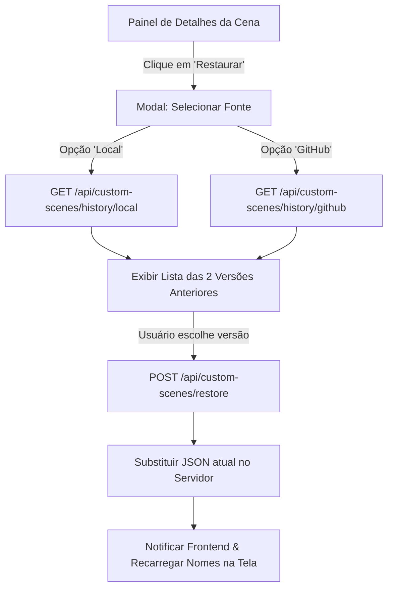

# 📜 Plano de Implementação: Restauração de Nomes Customizados (Local vs. GitHub)

Este documento descreve a especificação técnica e o passo a passo para a implementação da funcionalidade de **Restauração de Versões Anteriores** dos arquivos JSON de nomes customizados (`custom_names_scene-*.json`).

---

## 🚨 Regras Fundamentais de Desenvolvimento (Diretrizes Obrigatórias)

Para qualquer desenvolvedor ou agente de IA (OpenCode) que for executar este plano, as seguintes regras **DEVEM** ser seguidas rigorosamente sem exceção:

1. 🛑 **NÃO fazer `git commit`**: O desenvolvedor/agente NÃO deve realizar commits no repositório a menos que o usuário solicite explicitamente.
2. ⚡ **Validação de Código Rust (`cargo check`)**: Usar exclusivamente `cargo check` para verificar a compilação do código no servidor Rust. **NUNCA** usar `cargo build --release` sem solicitação direta do usuário.
3. 📊 **Atualização do Graphify (`graphify update .`)**: NÃO executar `graphify update .` após cada pequena edição de código. O comando `graphify update .` só deve ser executado imediatamente antes de realizar um `git push` solicitado pelo usuário.

---

## 🎯 Objetivo da Funcionalidade

Permitir que o usuário, ao visualizar os detalhes de uma cena no **Painel de Nomes Customizados**, consiga restaurar até as **duas versões anteriores** do arquivo JSON de nomes. 

A restauração oferece duas fontes distintas:
- 💻 **Git Local**: Busca o histórico de alterações gravado no repositório Git local da máquina (rápido, funciona 100% offline).
- ☁️ **GitHub (Nuvem)**: Busca o histórico de commits do repositório remoto via API do GitHub (permite resgatar versões sincronizadas por outros dispositivos via Ninja Sync).

---

## 📐 Arquitetura & Fluxo da Solução



---

## 🛠️ Especificação de Endpoints (Backend Rust)

### 1. Histórico Git Local
* **Endpoint:** `GET /api/custom-scenes/history/local?file=<nome_do_arquivo.json>`
* **Lógica:**
  * O servidor executa internamente o comando Git para listar os últimos 2 commits **anteriores** ao HEAD do arquivo especificado em `data/custom_scenes/shared/`:
    ```bash
    git log -n 2 --skip=1 --format="%H|%an|%ad|%s" -- data/custom_scenes/shared/<nome_do_arquivo.json>
    ```
  * Retorna um JSON contendo a lista de commits:
    ```json
    {
      "source": "local",
      "file": "custom_names_scene-PGD ONLINE 360-mesa-maria.json",
      "versions": [
        {
          "commit_sha": "a1b2c3d4e5f6...",
          "author": "Operador PA",
          "date": "2026-08-06T20:15:00Z",
          "message": "Ninja Sync: Update custom scene names"
        },
        {
          "commit_sha": "f6e5d4c3b2a1...",
          "author": "Operador PA",
          "date": "2026-08-05T14:30:00Z",
          "message": "Ninja Sync: Update custom scene names"
        }
      ]
    }
    ```

### 2. Histórico Nuvem GitHub
* **Endpoint:** `GET /api/custom-scenes/history/github?file=<nome_do_arquivo.json>`
* **Lógica:**
  * O servidor realiza uma chamada HTTP GET para a API REST do GitHub:
    `GET https://api.github.com/repos/{owner}/{repo}/commits?path=data/custom_scenes/shared/<nome_do_arquivo.json>&per_page=3`
  * Utiliza o token GitHub (PAT) salvo nas configurações (caso exista) no header `Authorization: Bearer <TOKEN>`.
  * Despreza a primeira versão (versão atual) e retorna os 2 commits anteriores formatados no mesmo contrato JSON do endpoint local.

### 3. Restauração de Conteúdo
* **Endpoint:** `POST /api/custom-scenes/restore`
* **Payload:**
  ```json
  {
    "file": "custom_names_scene-PGD ONLINE 360-mesa-maria.json",
    "source": "local", // ou "github"
    "commit_sha": "a1b2c3d4e5f6..."
  }
  ```
* **Lógica:**
  * Se `source == "local"`: executa `git show <commit_sha>:data/custom_scenes/shared/<file>` para extrair o conteúdo do arquivo no commit selecionado.
  * Se `source == "github"`: faz uma chamada para `https://raw.githubusercontent.com/{owner}/{repo}/{commit_sha}/data/custom_scenes/shared/<file>`.
  * Valida se o conteúdo retornado é um JSON válido de cena.
  * Sobrescreve o arquivo no sistema de arquivos local (`data/custom_scenes/shared/<file>`).
  * Emite um evento via WebSocket/broadcast para avisar aos clientes conectados que a cena foi atualizada.
  * Opcional: dispara um novo salvamento/sync se o Ninja Sync automático estiver ativo.

---

## 🎨 Especificação de Interface (Frontend JS / HTML / CSS)

### 1. Painel de Detalhes da Cena Customizada (`public/modules/custom_scenes.js` ou equivalente)
* No topo da modal/view de detalhes da cena, ao lado dos controles existentes, adicionar o botão:
  * `<button id="btn-restore-scene-version" class="btn btn-secondary"><i class="icon-history"></i> Restaurar Versão</button>`

### 2. Modal de Escolha da Fonte (`Modal 1: Fonte`)
* Exibe uma pergunta simples: **"De onde deseja buscar o histórico de versões?"**
* Dois botões grandes e acessíveis:
  * 💻 **[ Histórico Local ]** (Subtexto: *Busca no repositório da própria máquina. Rápido e offline.*)
  * ☁️ **[ Nuvem GitHub ]** (Subtexto: *Busca commits salvos via Ninja Sync no repositório remoto.*)

### 3. Modal de Escolha da Versão (`Modal 2: Versões`)
* Exibe a lista das 2 versões anteriores retornadas pelo backend.
* Cada item do card deve conter:
  * Ícone e Tag informando o hash resumido (ex: `a1b2c3d`).
  * Data/Hora formatada amigavelmente (ex: *Ontem às 20:15*).
  * Mensagem associada ao commit.
  * Botão de ação: `<button class="btn btn-warning btn-apply-restore" data-sha="...">Restaurar Esta Versão</button>`
* Modal de confirmação final: *"Tem certeza que deseja substituir os nomes atuais pelos nomes da versão selecionada?"*

---

## 📝 Passo a Passo de Execução para o OpenCode / Desenvolvedor

### Passo 1: Backend Rust (`server_rust/src/custom_scenes.rs` ou módulo correspondente)
1. Criar struct para representar o item de versão do arquivo (`SceneVersionInfo`).
2. Criar função para obter histórico via `git log` no sistema de arquivos local.
3. Criar função para obter histórico via reqwest/HTTP na API do GitHub.
4. Criar a rota de restauração que obtém o conteúdo por SHA e grava no disco.
5. **Verificação:** Executar `cargo check` na pasta `server_rust`.

### Passo 2: Endpoints HTTP / Socket Handlers (`server_rust/src/socket_handlers.rs` ou `api/`)
1. Registrar as novas rotas API ou handlers WebSocket para histórico e restauração.
2. Garantir tratamento de erros amigável (ex: sem internet para o GitHub, arquivo não encontrado, SHA inválido).
3. **Verificação:** Executar `cargo check`.

### Passo 3: Frontend Interface (`public/modules/custom_scenes.js` / HTML)
1. Inserir o botão "Restaurar Versão" no cabeçalho do detalhe da cena customizada.
2. Implementar a criação dinâmica do modal de escolha de fonte (Local vs. GitHub).
3. Implementar a listagem das versões e ação de restauração com requisição ao backend.
4. Ao receber o sucesso da restauração, atualizar o estado local dos nomes e re-renderizar a grade/tabela de canais.

---

## ✅ Lista de Verificação e Validação

- [ ] `cargo check` executa sem erros de compilação ou avisos críticos.
- [ ] O botão "Restaurar Versão" aparece corretamente no painel de detalhes da cena.
- [ ] A escolha **Local** funciona offline e retorna os 2 commits anteriores.
- [ ] A escolha **GitHub** traz os commits remotos quando conectado à internet.
- [ ] Ao confirmar a restauração, os nomes dos canais na tela são atualizados instantaneamente.
- [ ] NENHUM commit Git foi realizado automaticamente durante o desenvolvimento.
- [ ] NENHUM `cargo build --release` foi rodado desnecessariamente.
