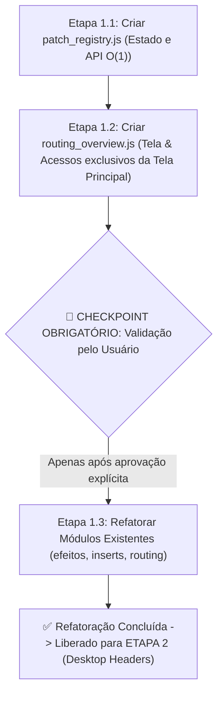

# Plano de Refatoração Arquitetural: Routing & Patch Registry Centralizado

> **Ordem de Execução**: **ETAPA 1 (PRÉ-REQUISITO OBRIGATÓRIO)**  
> **Status**: **Fase 1.1 e 1.2 CONCLUÍDAS e VALIDADAS PELO USUÁRIO (Checkpoint Aprovado)** | Próxima: Fase 1.3  
> **Dependência**: Nenhuma. Deve ser executado e validado **antes** de qualquer alteração visual no channel strip desktop.  
> **Novos Módulos**: `public/modules/patch_registry.js`, `public/modules/routing_overview.js`  
> **Módulos Afetados**: `public/index.html`, `public/modules/sidebar.js`, `public/modules/socket.js`, `public/modules/FXS/efeitos.js`, `public/modules/inserts.js`, `public/modules/routing.js`  
> **Objetivo**: Implementar o **Registro Reativo Centralizado (`window.PatchRegistry`)** e a **Tela de Roteamento Geral (Read-Only)** como etapa de validação segura antes de qualquer refatoração nos módulos existentes.

---

> [!IMPORTANT]
> ### 📌 HIERARQUIA E ORDEM DE EXECUÇÃO
> 1. **ETAPA 1 (ESTE DOCUMENTO)**: Criação do `PatchRegistry`, da Tela de Roteamento Geral e refatoração dos módulos de roteamento/efeitos/inserts.
> 2. **ETAPA 2 (`plano_de_implementacao_desktop_patch_header.md`)**: Redimensionamento dos faders desktop (-25% cabeçalho, -25% SOLO, -10% ON) e inclusão do badge de patch. **Só pode ser iniciado após este plano estar 100% concluído e validado.**

---

> [!CAUTION]
> ### 🚨 REGRA CRÍTICA: ZERO ALTERAÇÕES NO SYNC INICIAL & BACKEND
> O mecanismo de **Sync Inicial** é a parte mais crítica e sensível do sistema:
> 1. **Nenhum arquivo do Backend Rust** (`sync_manager.rs`, `midi_receiver.rs`, `protocol.rs`, `state.rs`, etc.) será alterado.
> 2. **Nenhuma rotina de fila, handshake ou envio de mensagens MIDI de boot** será modificada.
> 3. **O payload do WebSocket no frontend (`state` / `initial_state`) continuará sendo processado exatamente como já é hoje**.
> 4. O `PatchRegistry` atuará de forma **100% passiva e não-invasiva**: ele apenas indexará os dados que o frontend já recebe naturalmente, sem disparar requisições extras de rede.

---

## 1. Visão Geral da Arquitetura Modular

Para manter a separação estrita de responsabilidades, criaremos **dois novos módulos dedicados**:

1. **`public/modules/patch_registry.js`**:
   - Módulo puro de estado e regras de negócio.
   - Normaliza os dados brutos recebidos da mesa em tabelas indexadas $O(1)$.
   - Expõe a API global `window.PatchRegistry` para todo o aplicativo.

2. **`public/modules/routing_overview.js`**:
   - Módulo de interface gráfica dedicado à **Tela de Visão Geral do Roteamento**.
   - Renderiza um painel completo (read-only) com todas as conexões da mesa: Entradas, Saídas Físicas, Barramentos MIX/BUS, Efeitos FX1-4 e Inserts.
   - Serve como ferramenta de **validação visual imediata** para comprovar que o `PatchRegistry` está refletindo fielmente a mesa física em tempo real.

---

## 2. Pontos de Acesso na Interface (Exclusivo da Tela Principal)

> [!IMPORTANT]
> **Visibilidade Exclusiva da Tela Principal (`mode === 'main'`)**:
> O acesso à tela de Roteamento Geral **só deve existir na tela principal** da mesa (visão geral dos canais). Quando o usuário estiver dentro de telas de configuração específica (`channelConfig`, `outsMode`, `techMix` ou modo músico), o botão de roteamento **NÃO** é exibido.

1. **Modo Desktop & Modo Mobile Landscape (Orientação Horizontal)**:
   - Exibido na **Sidebar lateral** no dock de botões (`#buttonDock`).
   - O botão **`ROTEAMENTO`** é renderizado **apenas** no bloco `case 'main'` do `renderDock(mode)` em `sidebar.js`.

2. **Modo Mobile Portrait (Orientação Retrato / Bottom Bar)**:
   - A sidebar converte-se na **Bottom Bar** contendo o botão `MENU`.
   - Ao tocar em `MENU`, o item **`ROTEAMENTO GERAL`** é renderizado **apenas** no bloco `case 'main'` do `renderMobileMenu(mode)` em `sidebar.js`.

---

## 3. Roteiro de Execução em Fases com Checkpoint Obrigatório

---

### Fase 1.1: Criação do Módulo `patch_registry.js`
- **Arquivo**: `public/modules/patch_registry.js`
- **Inclusão**: `public/index.html` (carregado imediatamente após `globals.js`).
- **Responsabilidade**:
  - Manter o objeto `window.patchRegistry`.
  - Método `syncFromGlobalState()`: lê passivamente `channelStates` e `window.globalOutPatches` quando o sync termina.
  - Métodos reativos: `setInputPatch(ch, val)`, `setOutputPatch(portType, portIdx, src)`, `setFxInput(...)`, `setFxOutput(...)`.
  - Métodos de consulta $O(1)$:
    - `getChannelInput(logicCh)` $\rightarrow$ `"AD 1"`, `"ADAT 5"`, `"--"`
    - `getPairedChannelInput(ch1, ch2)` $\rightarrow$ `"AD 1 + AD 2"`
    - `getMixOutput(mixIdx)` $\rightarrow$ `"OMNI 1"`, `"--"`
    - `getBusOutput(busIdx)` $\rightarrow$ `"ADAT 3"`, `"--"`
    - `getFxInfo(slot)` $\rightarrow$ `{ inL, inR, outL, outR }`
    - `getInsertInfo(ch)` $\rightarrow$ `{ in, out, pos, on }`
    - `getAllData()` $\rightarrow$ Retorna o mapa consolidado completo para a tela de visualização.

---

### Fase 1.2: Criação da Tela de Roteamento Geral (`routing_overview.js`)
- **Arquivo**: `public/modules/routing_overview.js`
- **Modal**: `#routingOverviewModal` (design profissional, responsivo, tema escuro).
- **Conteúdo Exibido no Painel (Read-Only)**:
  1. **Seção 1: Entradas dos Canais (CH 1–32 & ST IN 1–4)**: Cada canal com seu nome e patch de entrada configurado (`AD 1..16`, `ADAT 1..8`, `SLOT`, `FX`, etc.).
  2. **Seção 2: Saídas Físicas (OMNI 1–4, ADAT 1–8, SLOT 1–16, 2TR)**: Cada porta física e qual origem interna está roteada para ela (`STEREO L/R`, `AUX 1..8`, `BUS 1..8`, `DIRECT OUT`).
  3. **Seção 3: Barramentos de Saída (MIX 1–8 & BUS 1–8)**: Destinos físicos atribuídos a cada MIX e BUS.
  4. **Seção 4: Efeitos (FX 1 a FX 4)**: Entradas (L/R) e Saídas/Destinos (L/R) dos 4 processadores.
  5. **Seção 5: Inserts Ativos**: Canais com insert ligado, ponto de inserção (`PRE EQ`, `PRE FADER`, `POST FADER`), entrada e saída.

- **Integração de Acesso**:
  - `sidebar.js` $\rightarrow$ `renderDock('main')`: Adiciona botão `ROTEAMENTO` exclusivamente no modo `'main'`.
  - `sidebar.js` $\rightarrow$ `renderMobileMenu('main')`: Adiciona item `ROTEAMENTO GERAL` exclusivamente no modo `'main'`.

---

### 🛑 CHECKPOINT OBRIGATÓRIO (Pausa para Validação do Usuário)
> [!IMPORTANT]
> **O agente irá parar a execução após concluir as Fases 1.1 e 1.2.**  
> O usuário abrirá a aplicação, clicará no botão `ROTEAMENTO` (ou MENU no celular retrato) na tela principal e verificará visualmente na nova tela se:
> 1. Todas as entradas (AD, ADAT, etc.) coincidem com a mesa real.
> 2. Todas as saídas (Omni, Adat, etc.) coincidem com a mesa real.
> 3. Os processadores de efeito mostram as entradas e saídas corretas.
>
> **Nenhum módulo existente será modificado antes desta confirmação explícita.**

---

### Fase 1.3: Refatoração Modular dos Consumidores (Inserts & Routing)

- **Fase 1.3a (`efeitos.js`)**: ✅ **CONCLUÍDA E VALIDADA** (tela de efeitos 100% migrada para o `PatchRegistry`).
- **Fase 1.3b (`inserts.js`) + 1.3c (`routing.js`)**: Execução unificada direta.
  * **`public/modules/inserts.js`**: Substituir rotinas manuais de cálculo numérico pelas consultas centralizadas de `window.PatchRegistry.getInsertInfo(ch)`.
  * **`public/modules/routing.js`**: Remover tabela privada duplicada `getPatchName(val)` e unificar no `window.PatchRegistry.getChannelInput(ch)`. Atualizar `selectPatch` para sincronizar reativamente com `PatchRegistry.setInputPatch()`.
- **🛑 CHECKPOINT FINAL DA ETAPA 1**: Validação completa do usuário (Efeitos, Inserts, Routing e Painel Geral) antes de liberar a ETAPA 2 (Desktop Headers).

---

## 4. Plano de Verificação da Etapa 1

### 4.1 Verificação da Fase 1.1, 1.2 e 1.3a (Concluídas)
- `cargo check` garantido limpo.
- `PatchRegistry` e Tela de Roteamento Geral em produção.
- `efeitos.js` consumindo 100% do registro sem redundâncias locais.

### 4.2 Verificação Final da Fase 1.3b e 1.3c
- Validação com `node --check` e `cargo check`.
- Verificação do modal de Inserts e da aba Routing/ETC dos canais.
- Teste de troca de patch em tempo real com atualização bidirecional imediata.
