# Plano Geral de Refatoração de Arquitetura & Componentes (Frontend V2)

## 1. Visão Geral e Objetivo Estratégico

Este documento é o **Plano Mestre de Refatoração do Frontend** do projeto `01v96-remote-web`.

O objetivo geral é transformar a base de código do frontend em uma **Arquitetura Modular Limpa**, organizada por camadas claras de responsabilidade (**Componentes**, **Telas / Visões**, **Controladores de Setup**, **Serviços**, **Núcleo de Estado** e **Utilitários**). Isso elimina acoplamentos históricos, código duplicado e arquivos monolíticos, criando uma base sólida, extensível e profissional para as próximas evoluções do sistema.

### Princípios da Refatoração (Estratégia de Passos Seguros):
1. **Refatoração Segura em Pequenos Passos Verificáveis (*"Make the change easy, then make the easy change"*):**
   - **Passo 1 (Organização Física Zero-Risk):** Primeiro organizamos todos os arquivos legados existentes em suas respectivas pastas (`core/`, `services/`, `components/`, `screens/`, `screens/channel_setup/`, `utils/`) e atualizamos as referências de `<script>` em `public_new/index.html` **sem alterar a lógica interna de nenhum arquivo**. Isso estabelece uma "Linha de Base Verde", garantindo que a rota `/new` continue 100% funcional e sem erros 404 antes de refatorar código.
   - **Passo 2 (Refatoração Granular Arquivo por Arquivo):** Após a organização física validada, iniciamos a refatoração arquivo por arquivo (começando pela classe `ChannelStrip` modular universal), testando cada módulo isoladamente para garantir contexto total e zero suposições.
2. **Ambiente Isolado (`public_new/`):** Todo o trabalho de refatoração ocorre exclusivamente dentro de `public_new/`, acessível pela rota `/new`. A pasta `public/` original permanece 100% intacta como ambiente funcional de produção e fallback.
3. **Separação Estrita entre "Componente Visual Puro" e "Controlador de Tela":**
   - **Componentes (`components/`):** Widgets gráficos reutilizáveis (Canvas de EQ, medidores, faders, modal base). Não conhecem canais específicos nem regras de tela; recebem parâmetros e emitem eventos/callbacks.
   - **Telas de Canal (`screens/channel_setup/`):** Orquestram o estado da mesa, pegam o canal ativo (`activeConfigChannel`), conectam ao socket/MIDI e montam a aba consumindo os componentes puros.
   - **Nomenclatura Explícita (`channel_setup_*.js`):** Arquivos dentro de `screens/channel_setup/` usam o prefixo para clareza semântica imediata e economia de tokens.
4. **Controle Estrito de Versionamento:** Nenhum commit é realizado sem solicitação explícita.
5. **Evolução Gradual por Épicos:** Começamos pelo núcleo visual mais crítico (o **Channel Strip Universal** e suas telas consumidoras) e avançamos para os subsistemas especializados de processamento e roteamento.

---

## 2. Estrutura Canônica de Diretórios (`public_new/`)

```text
public_new/
├── index.html
├── style.css                  <-- CSS Legado Monolítico (será migrado e encolhido gradualmente)
├── app.js
├── steps.json
│
├── styles/                    <-- [ARQUITETURA MODULAR DE ESTILOS CSS]
│   ├── base/                  <-- Estilos Base e Globais
│   │   ├── base.css           <-- Reset global, touch-action, scrollbars e fontes
│   │   ├── layout.css         <-- Estrutura principal, viewport, sidebar e dock
│   │   └── splash_screen.css  <-- Tela de carregamento e inicialização
│   │
│   ├── components/            <-- Estilos dos Componentes Visuais Puros
│   │   ├── channel_strip.css  <-- Fader Universal (Desktop/Mobile, Nudges, VU 60FPS)
│   │   ├── eq.css             <-- Curva Biquad 4 Bandas, nós de arrasto e balão de Q
│   │   ├── rta.css            <-- Espectro do analisador em tempo real (RTA)
│   │   ├── dynamics.css       <-- Curvas Gate/Comp e medidores de redução de ganho (GR)
│   │   ├── inserts.css        <-- Grid de pontos de inserção e patches
│   │   ├── routing.css        <-- Matriz de barramentos BUS 1-8, Direct Out e Pan
│   │   ├── sidebar.css        <-- Barra de navegação lateral e dock de ferramentas
│   │   ├── search.css         <-- Barra de busca e filtro rápido de canais
│   │   ├── theme-editor.css   <-- Editor visual de temas em tempo real
│   │   ├── overlay_info.css   <-- Tooltips e popovers informativos
│   │   └── modals/            <-- Estilos de Modais e Diálogos
│   │       ├── confirm-modal.css    <-- Diálogos de confirmação e alertas
│   │       ├── bubble-modal.css     <-- Modais tipo balão contextual
│   │       ├── virtual-keyboard.css <-- Teclado virtual na tela
│   │       └── color-picker.css     <-- Seletor visual de cores
│   │
│   └── screens/               <-- Estilos de Layout de Telas / Visões
│       ├── main_view.css              <-- Layout da Tela Principal (32 CHs, Master PA, Macro)
│       ├── auxs_sends.css             <-- Layout da Tela de Auxiliares (Sends on Faders)
│       ├── outs_view.css              <-- Layout da Tela de Saídas (MIX 1-8 e BUS 1-8)
│       ├── musician_view.css          <-- Layout da Tela do Músico (Envios + Lock)
│       ├── routing_overview.css       <-- Layout da Matriz Geral de Roteamento
│       ├── scenes_view.css            <-- Layout do Grid de Cenas e Presets
│       │
│       └── channel_setup/     <-- Estilos do Subsistema de Edição do Canal
│           ├── channel_setup_core.css     <-- Shell do Modal: Abas, ◀ ▶ e Dock do Mini-Fader
│           ├── channel_setup_eq.css       <-- Layout da Aba EQ (knobs de 4 bandas + HPF + RTA)
│           ├── channel_setup_dynamics.css <-- Layout da Aba Dinâmica (Gate + Comp)
│           ├── channel_setup_aux.css      <-- Layout da Aba AUX (Grid 8 envios + Vol. Geral)
│           ├── channel_setup_inserts.css  <-- Layout da Aba Inserts
│           └── channel_setup_routing.css  <-- Layout da Aba Roteamento / Pan / Pair
│
├── themes/                    <-- Definições de Temas YAML (default.yaml)
│   └── default.yaml
│
├── wasm/                      <-- Motor de Áudio/Meters em WebAssembly
│   ├── client_wasm.js
│   └── client_wasm_bg.wasm
│
├── vendor/                    <-- Bibliotecas de Terceiros
│   ├── fontawesome/
│   ├── js-yaml/
│   ├── qrcode.min.js
│   └── socket.io.min.js
│
└── modules/
    │
    ├── components/            <-- [COMPONENTES & WIDGETS VISUAIS PUROS REUTILIZÁVEIS]
    │   ├── channel_strip.js   <-- Classe Única ChannelStrip (Canais Padrão & Macros Diferenciais)
    │   ├── eq.js              <-- Componente Visual Puro: Canvas/Curva Biquad 4 Bandas & Balão de Q
    │   ├── compressor.js      <-- Componente Visual Puro: Curva de Dinâmica & Medidor de GR
    │   ├── gate.js            <-- Componente Visual Puro: Medidores Input/GR & Controles de Gate
    │   ├── dynamics.js        <-- Widget Integrador: Layout e física unificada Gate + Compressor
    │   ├── inserts.js         <-- Widget Visual: Grid de seleção e chaveamento de slots de Insert
    │   ├── routing.js         <-- Widget Visual: Matriz de atribuição BUS 1-8, Direct Out e Stereo
    │   ├── rta.js             <-- Gráfico do Analisador de Espectro em Tempo Real (RTA)
    │   ├── sidebar.js         <-- Barra lateral de ferramentas / Dock de navegação
    │   ├── search.js          <-- Barra de busca e filtro rápido de canais
    │   ├── theme-editor.js    <-- Editor visual de temas em tempo real
    │   ├── overlay_info.js    <-- Tooltips e overlays de feedback
    │   └── modals/            <-- [MODAIS E DIÁLOGOS DE SISTEMA]
    │       ├── confirm-modal.js   <-- Modal genérico de confirmação / Wizard
    │       ├── bubble-modal.js    <-- Modais tipo balão contextual
    │       ├── virtual-keyboard.js<-- Teclado virtual na tela
    │       └── color-picker.js    <-- Seletor visual de cores
    │
    ├── screens/               <-- [CONTROLADORES DE TELAS / VISÕES GERAIS]
    │   ├── main_view.js       <-- Tela Principal do Mixer (32 CHs de Entrada, ST IN e Master PA)
    │   ├── auxs_sends.js      <-- Tela de Envios Auxiliares (Sends on Faders & Mix Matrix)
    │   ├── outs_view.js       <-- Tela de Barramentos de Saída (MIX 1-8 Masters e BUS 1-8)
    │   ├── musician_view.js   <-- Tela simplificada do Músico (Envios de Fone + Bloqueio)
    │   ├── routing_overview.js<-- Visão geral matricial de Roteamento
    │   ├── scenes_view.js     <-- Tela de Gerenciamento de Cenas e Presets
    │   │
    │   └── channel_setup/     <-- [SUBSISTEMA DA CENTRAL DE EDIÇÃO DO CANAL]
    │       ├── channel_setup_core.js       <-- Host orquestrador (abas, navegação ◀ ▶, mini-fader)
    │       ├── channel_setup_eq.js         <-- Controlador da aba de Equalização
    │       ├── channel_setup_dynamics.js   <-- Controlador da aba de Dinâmica (Gate + Comp)
    │       ├── channel_setup_gate.js       <-- Painel de Gate do canal ativo
    │       ├── channel_setup_compressor.js <-- Painel de Compressor do canal ativo
    │       ├── channel_setup_aux.js        <-- Aba de 8 envios AUX + Volume Geral do canal
    │       ├── channel_setup_inserts.js    <-- Aba de seleção de Inserts do canal
    │       └── channel_setup_routing.js    <-- Aba de Roteamento (Direct Out, Bus 1-8, Stereo)
    │
    ├── services/              <-- [SERVIÇOS DE REDE, ÁUDIO, SEGURANÇA E DADOS]
    │   ├── socket.js          <-- Comunicação WebSocket / MIDI com a mesa 01V96
    │   ├── monitoring.js      <-- Streaming de Áudio em Tempo Real (WebCodecs / PCM / Opus)
    │   ├── patch_registry.js  <-- Registro e resolução de Patch I/O (ADAT, OMNI, SLOT)
    │   ├── theme-manager.js   <-- Carregador e injetor de variáveis CSS de temas YAML
    │   ├── channel_lock.js    <-- Serviço de trava de segurança e proteção de canais
    │   └── copy_paste.js      <-- Serviço de cópia e colagem de parâmetros de contexto
    │
    ├── core/                  <-- [ESTADO GLOBAL E INFRAESTRUTURA DE EXECUÇÃO]
    │   ├── globals.js         <-- Estado da mesa em memória (channelStates, mixesState, etc.)
    │   ├── events.js          <-- Hub e Barramento central de eventos de interface
    │   ├── steps.js           <-- Calibração dB / Range de Medidores da 01V96
    │   ├── setup.js           <-- Configurações gerais da aplicação
    │   └── splash_screen.js   <-- Tela de carregamento e inicialização
    │
    ├── utils/                 <-- [UTILITÁRIOS E HELPERS GERAIS]
    │   ├── scroll.js          <-- Algoritmos de rolagem suave e touch
    │   └── fps_meter.js       <-- Medidor de taxa de quadros (60 FPS)
    │
    ├── FXS/                   <-- [SUBSISTEMA DE PROCESSADORES DE EFEITOS]
    │   ├── fx_core.js
    │   ├── fx_components.js
    │   ├── fx_registry.js
    │   ├── fx_routing.js
    │   ├── fx_utils.js
    │   ├── reverb.js
    │   ├── multiband_compressor.js
    │   ├── efeitos.js
    │   └── fx.css
    │
    └── macros/                <-- [SUBSISTEMA DE MACROS & AUTOMAÇÃO]
        ├── core.js
        ├── lumikit/
        ├── channel_toggler/
        ├── smart_channel_toggler/
        └── profiles/
```

---

## 3. Especificação do Channel Strip Universal (Canais & Macros)

O `ChannelStrip` é o componente universal que centraliza a renderização, a física e os eventos de qualquer faixa de controle do mixer.

### 3.1 Arquitetura Canônica das 7 Zonas Modulares

```text
┌────────────────────────────────────────────────────────────────────────────────────────┐
│  ZONA                      │  CANAL NORMAL (1-32, ST, MASTER, MINI) │  MACRO / VOL. GERAL     │
├────────────────────────────┼────────────────────────────────────────┼────────────────────────┤
│ [1] HEADER (Tripartite)    │ [Copy/Swap (Futuro)] [CH X] [Lock 🔒]  │ Rótulo (MACRO, AUX)    │
│ [2] TOP ACTION             │ Botão SOLO / CUE (ou Solo Replace)    │ Placeholder vazio      │
│ [3] DISPLAY                │ Visor OLED Verde (Nome do Canal)       │ Visor Nome / Perfil    │
│ [4] MIDDLE FEATURE         │ Pre/Post / Seletor de Medidores        │ Visor Delta dB (-- dB) │
│ [5] PRIMARY ACTION & NUDGE │ Botão ON (Mute) + Nudge Fino (+)       │ (Ocupado p/ Big Nudges)│
│ [6] FADER CORE             │ dB, Régua, Fader 0-1023, VU 60FPS, (-) │ Big Nudges (+) e (-)   │
│ [7] FOOTER ROUTING & ACTION│ Panpot (L-C-R) + Badge de Patch I/O    │ Botão [ZERAR] / [CONFIG│
└────────────────────────────────────────────────────────────────────────────────────────┘
```

#### Detalhamento Estrutural das Zonas:
1. **Zona 1 — Header / Identificação Superior (Layout Tripartite `desk-label-wrapper`):**
   - **Slot Esquerdo:** Slot reservado para ações contextuais rápidas futuras (ex: ícone de copiar/colar canal, trocar ordem/swap, preset rápido). Deixado flexível/placeholder sem quebrar o layout.
   - **Centro (Rótulo Principal):** Identificação do canal (`CH 1`, `ST 1`, `MIX 1`, `STEREO`, `MACRO`). Clique abre o *Channel Setup* ou modal correspondente.
   - **Slot Direito:** Ícone de cadeado / trava de segurança 🔒 (`channel_lock`).
   - *Nota Mobile:* No modo mobile, a Zona 1 é limpa e 100% centralizada apenas com a identificação do canal.
2. **Zona 2 — Top Action / Solo:**
   - Canal Padrão: Botão `SOLO` / `CUE` (amarelo).
   - Mini-Fader (Setup): Comportamento `Solo Replace`.
   - Master PA: Indicador global de Solo ativo + botão `clearAllSolos()`.
   - Modo Auxiliar (Sends on Faders): Badge contextual de envio `[PRE]` / `[POST]` / `[FIXED]`.
   - Macro: Placeholder vazio de alinhamento.
3. **Zona 3 — Display Digital de Nome (`desk-ch-name-zone`):**
   - Visor OLED estilo hardware com tipografia verde brilhante (`#00ff00`).
   - No Mini-Fader, clique abre o teclado virtual (`VirtualKeyboard`) para edição in-place.
4. **Zona 4 — Middle Feature / Painel de Informações Contextuais (Componente Genérico Reutilizável):**
   - **Arquitetura Reutilizável:** Estrutura modular em bloco retangular (`desk-feature-box`) compartilhada entre Master, Auxiliares e Macros, mudando apenas tipografia, cor de acento e ações:
     - **Master Stereo LR (`Painel MEDIDORES`):** Título `MEDIDORES` em tom avermelhado/rosa, com linhas `MASTER: [ POST ]` e `CANAIS: [ PREEQ ]` para comutação rápida de pontos de medição.
     - **Master Auxiliar / Mini-Fader Contextual (`Painel POSIÇÃO`):** Título `POSIÇÃO` em tom dourado/âmbar (`#d4af37`), com linhas `GLOBAL: [ PRE ]` (comuta tomada de sinal global) e `PRE-P: [ PRE ON ]` (comuta ponto do Pre-ON vs Pre-Fader).
     - **Modo Macro:** Botão roxo `[CONFIG]` + Visor OLED de **Delta dB** (`--` em repouso / `+1.50 dB` dinâmico).
5. **Zona 5 — Primary Action & Nudge Superior:**
   - Canal Normal / Master / Aux: Botão principal **ON** (laranja/amarelo ativo) posicionado logo abaixo de SOLO / Display.
   - Botão de **Nudge Superior (+)**: Micro-ajuste incremental de ganho com suporte a **toque/clique único (step específico por tipo)** e **Long Press / Segurar Pressionado (auto-repeat acelerado contínuo)**.
6. **Zona 6 — Fader Core (Controle Central e Balística de Áudio):**
   - Canal Normal: Visor de dB, Régua lateral (+10 a -∞), Fader vertical de 10-bit (0–1023), VU Meter 60 FPS (WASM) com Peak LED e botão de **Nudge Inferior (-)** fino (mesmo step e física de longpress do Nudge Superior).
   - **Tabela Canônica de Steps dos Botões de Nudge (+ e -):**
     - **Canais de Input (Mono 1-32, Pareados 1-32 e ST IN 1-4) e Master Stereo LR:** Step de **`0.05 dB`** por clique/toque de botão.
     - **Canais de Saída (MIX 1-8 e BUS 1-8):** Step de **`0.10 dB`** por clique/toque de botão.
     - **Sends on Faders e Tela de AUX Individual:** Step de **`0.50 dB`** por clique/toque de botão.
     - **Macro Fader (Modo Técnico):** Step de **`0.05 dB`** por clique/toque nos Big Nudges.
     - **Macro Fader de Volume Geral (Sends on Faders / Tela AUX):** Step de **`0.10 dB`** por clique/toque nos Big Nudges.
     - **Macro Fader de Volume Geral (Modo Músico):** Step de **`0.25 dB`** por clique/toque nos Big Nudges.
   - **Tabela Canônica de Steps da Roda do Mouse (*Scroll Wheel* — Desktop):**
     - **Canais de Input (Mono 1-32, Pareados 1-32 e ST IN 1-4) e Master Stereo LR:** Step de **`0.10 dB`** por entalhe do scroll wheel.
     - **Canais de Saída (MIX 1-8 e BUS 1-8):** Step de **`0.50 dB`** por entalhe do scroll wheel.
     - **Sends on Faders e Tela de AUX Individual:** Step de **`0.50 dB`** por entalhe do scroll wheel.
     - **Macro Faders (Técnico, AUX Geral e Modo Músico):** **Sem suporte a roda do mouse** (ação exclusiva via Big Nudges).
   - **Comportamento de Long Press (Desktop e Mobile):** Ao segurar pressionado qualquer botão de `(+)` ou `(-)` (no mouse ou touch screen), o valor inicia movimentação contínua automática (auto-repeat) acelerando progressivamente em alta velocidade enquanto mantido pressionado.
   - **Fader Rail Físico (Sem Salto por Toque):** Em ambos os layouts (Mobile e Desktop), o trilho/calha do fader é desabilitado para cliques diretos (sem salto de volume ao tocar ou clicar no curso). O ajuste só ocorre arrastando o thumb/knob ou usando os botões de nudge (+/-), reproduzindo com fidelidade a segurança operacional de uma mesa física.
   - **Roda do Mouse (Desktop Apenas nos Faders Individuais):** No modo Desktop, o knob/thumb e o trilho dos canais de Input e Master (`0.10 dB`), Saídas/Buses (`0.50 dB`) e Sends on Faders (`0.50 dB`) respondem à roda do mouse (*scroll wheel*) para incrementar/decrementar volume. Os canais em modo Macro (Técnico, AUX Geral e Músico) **não respondem à roda do mouse**.
   - Modo Mobile: Medidor VU implementado como **cortina de fundo total (`.has-meter` / `.mobile-meter-curtain`)** que preenche **100% da área útil do card do canal** de ponta a ponta:
     - **Gradiente Espectral Contínuo:** A cortina possui gradiente vertical que vai do **Verde puro** na base (sinal normal), passando por **Verde Claro / Amarelo** (atenção a partir de 60-85%), até culminar em **Vermelho vivo** no topo (98% a 100%).
     - **Preenchimento Integral:** Ocupa todo o espaço interior do canal (atrás dos botões, displays e fader), subindo fluidamente conforme a pressão sonora (Mono ou Estéreo Dividido L/R).
   - **Mecânica de PEAK no Mobile (`.peak-glow`):** Quando o sinal de áudio atinge $\ge 98\%$ da escala, a cortina encosta no topo do card (atingindo o vermelho máximo) e ativa o estado de PEAK:
     - Adiciona a classe `.peak-glow` ao card do canal.
     - Aplica contorno vermelho brilhante em todo o card: `border-color: #ff0000 !important; box-shadow: 0 0 15px rgba(255, 0, 0, 0.4) !important;`.
     - Permanece ativo com retenção de pico (*Peak Hold*) por **1000 ms (1 segundo)** após o sinal baixar de 98%, retornando automaticamente ao estado normal.
   - Modo Macro: **Big Nudges (+ e -)** com auto-repeat acelerado para ganho coletivo.
7. **Zona 7 — Footer Routing & Ações de Rodapé:**
   - Canal Normal: **Panpot (L-C-R)** com cursor centralizador e suporte a duplo pan (canais pareados) + **Badge de Patch I/O** com letreiro deslizante (*marquee*).
   - Macro Técnico / Modo Músico: Botão **`[CONFIG]`** ou rodapé limpo.
   - Macro Auxiliar / Setup: Botão vermelho **`[ZERAR]`** (com modal de confirmação para resetar envios dos 8 auxiliares).

---

### 3.2 Catálogo Visual e Estrutural das Variações Mobile (`docs/imgs/`)

No layout Mobile, a hierarquia vertical e a identidade visual de cada canal seguem 7 variações padronizadas.

* **Espaçamento e Agrupamento de Canais no Mobile (`gap` / `margin` e Blocos de 8 em 8):**
  * Diferente do Desktop, no modo **Mobile** os cards dos canais possuem um **espaçamento físico bem definido entre si (`gap` / margem lateral)** na lista com scroll horizontal. Isso garante toque limpo, evita disparos acidentais em canais adjacentes no palco e destaca individualmente o card de cada canal e sua cortina de medidor.
  * **Agrupamento de 8 em 8 canais:** A interface insere automaticamente um **espaçamento maior (gap/margem ampliada)** a cada bloco de 8 canais (ex: entre CH 8 e CH 9, entre CH 16 e CH 17, etc.), facilitando a orientação rápida do operador e refletindo a organização em bancos/camadas físicas da mesa.
  
  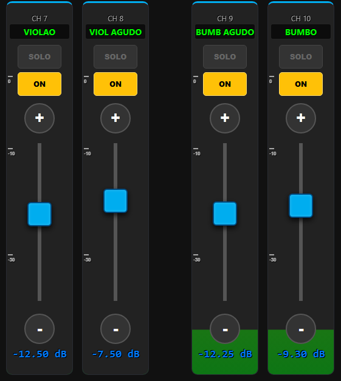

#### 1. Canal Mono Normal (`CH 13` / `SURDAO`) (CONCLUÍDO ✅)
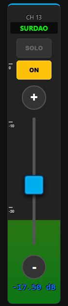

* **Controle de Volume e Fader Rail (Segurança Física):**
  * **Trilha Desabilitada para Toque:** A calha/trilho do fader é desabilitada para toques diretos (sem salto ou pulo de volume ao tocar no curso da trilha).
  * **Modificação Exclusiva por Arrasto:** O volume só é modificado arrastando ativamente o thumb/knob ou usando os botões de nudge (+/-), igual a uma mesa física de áudio.
* **Comportamento dos Nudges (+ e -):**
  * **Step por Toque:** Incremento/decremento fino de **`0.05 dB`** por toque de botão.
  * **Long Press (Auto-Repeat):** Ao segurar pressionado o botão `(+)` ou `(-)`, o volume se move continuamente acelerando enquanto mantido.

```text
┌──────────────────────────────────────────────┐
│                    CH 13                     │  <-- Zona 1 (Header Centralizado)
├──────────────────────────────────────────────┤  ═════════════════════════════════════════
│                  [ SURDAO ]                  │  ▲ [TOPO - 98% a 100%]: VERMELHO (PEAK)
├──────────────────────────────────────────────┤  │
│                    [SOLO]                    │  │ [ALTO - 85% a 98%]: AMARELO / LARANJA
├──────────────────────────────────────────────┤  │
│                     [ON]                     │  │ [MÉDIO - 60% a 85%]: VERDE CLARO
├──────────────────────────────────────────────┤  │
│                     (+)                      │  │ <-- Nudge (+0.05 dB / Long Press)
│                      │                       │  │ CORTINA VU METER DE FUNDO INTEGRAL
│    0 ───             │                       │  │ (Preenche 100% da área útil do card
│                      │                       │  │ de ponta a ponta, por trás de todos
│  -10 ───           [ █ ] ◄─ Arraste do Thumb │  │ os botões, displays e fader)
│        ░░░░░░░░░░░░░░│░░░░░░░░░░░░░░         │  │ ⚠️ Trilho desabilitado p/ toque direto
│  -30 ───▓▓▓▓▓▓▓▓▓▓▓▓▓│▓▓▓▓▓▓▓▓▓▓▓▓▓▓         │  │ ◄── Nível Atual do Sinal Subindo
│        ▓▓▓▓▓▓▓▓▓▓▓▓▓▓│▓▓▓▓▓▓▓▓▓▓▓▓▓▓         │  │
│                     (-)                      │  │ <-- Nudge (-0.05 dB / Long Press)
├──────────────────────────────────────────────┤  ▼ [BASE - 0% a 60%]: VERDE PURO
│                  -17.50 dB                   │  <-- Zona 6 (Leitura Numérica Neon)
└──────────────────────────────────────────────┘  ═════════════════════════════════════════
```

#### 2. Canal Pareado / Linkado (`CH 21 + 22` / `TECLADO`) (CONCLUÍDO ✅)
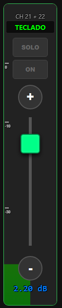

* **Controle de Volume e Fader Rail (Segurança Física):**
  * **Trilha Desabilitada para Toque:** A calha/trilho do fader é desabilitada para toques diretos (sem salto ou pulo de volume ao tocar no curso da trilha).
  * **Modificação Exclusiva por Arrasto:** O volume só é modificado arrastando ativamente o thumb/knob ou usando os botões de nudge (+/-), igual a uma mesa física de áudio.
* **Comportamento dos Nudges (+ e -):**
  * **Step por Toque:** Incremento/decremento de **`0.05 dB`** por toque de botão atuando em ambos os canais pareados.
  * **Long Press (Auto-Repeat):** Ao segurar pressionado o botão `(+)` ou `(-)`, o volume se move continuamente acelerando enquanto mantido.

```text
┌──────────────────────────────────────────────┐  <-- Borda Verde de Pareamento
│                  CH 21 + 22                  │  <-- Zona 1 (Header Pareado)
├──────────────────────────────────────────────┤  ═════════════════════════════════════════
│                 [ TECLADO ]                  │  ▲ [TOPO]: VERMELHO (PEAK)
├──────────────────────────────────────────────┤  │
│                    [SOLO]                    │  │ [ALTO]: AMARELO
├──────────────────────────────────────────────┤  │
│                     [ON]                     │  │ CORTINA VU DUAL (DIVIDIDA L / R)
├──────────────────────────────────────────────┤  │ (Preenche 100% do fundo em 2 colunas:
│                     (+)                      │  │  L = Canal Esquerdo, R = Canal Direito)
│                      │                       │  │ <-- Nudge (+0.05 dB / Long Press)
│    0 ───             │                       │  │
│                    [ █ ] ◄─ Arraste do Thumb │  │ ⚠️ Trilho desabilitado p/ toque direto
│  -10 ───             │                       │  │
│                      │                       │  │
│  -30 ───             │                       │  │
│        ▓▓▓▓▓▓▓▓▓▓ L  │  R ░░░░░░░░░░         │  │ ◄── L com sinal / R sem sinal
│                     (-)                      │  │ <-- Nudge (-0.05 dB / Long Press)
├──────────────────────────────────────────────┤  ▼ [BASE]: VERDE PURO
│                   2.20 dB                    │  <-- Zona 6 (Leitura Numérica Neon)
└──────────────────────────────────────────────┘  ═════════════════════════════════════════
```

#### 3. Master LR Stereo (`MASTER` / `ST`)
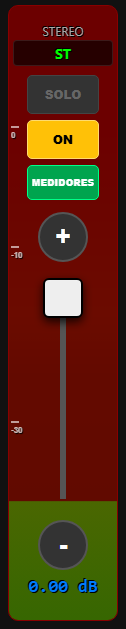

* **Controle de Volume e Fader Rail (Segurança Física):**
  * **Trilha Desabilitada para Toque:** A calha/trilho do fader é desabilitada para toques diretos (sem salto ou pulo de volume ao tocar no curso da trilha).
  * **Modificação Exclusiva por Arrasto:** O volume só é modificado arrastando ativamente o thumb/knob ou usando os botões de nudge (+/-), igual a uma mesa física de áudio.
* **Comportamento dos Nudges (+ e -):**
  * **Step por Toque:** Incremento/decremento fino de **`0.05 dB`** por toque de botão no Master (mesmo padrão dos canais de entrada).
  * **Long Press (Auto-Repeat):** Ao segurar pressionado o botão `(+)` ou `(-)`, o volume se move continuamente acelerando em alta velocidade enquanto mantido.

```text
┌──────────────────────────────────────────────┐  <-- Fundo Vinho / Vermelho Escuro
│                    MASTER                    │  <-- Zona 1 (Header Centralizado)
├──────────────────────────────────────────────┤  ═════════════════════════════════════════
│                    [ ST ]                    │  ▲ [TOPO - 98% a 100%]: VERMELHO (PEAK)
├──────────────────────────────────────────────┤  │
│                    [SOLO]                    │  │ [ALTO - 85% a 98%]: AMARELO
├──────────────────────────────────────────────┤  │
│                     [ON]                     │  │ CORTINA VU METER DE FUNDO INTEGRAL
├──────────────────────────────────────────────┤  │ (Preenche 100% do fundo do Master
│                 [MEDIDORES]                  │  │ de baixo até em cima)
├──────────────────────────────────────────────┤  │
│                     (+)                      │  │ <-- Nudge (+0.05 dB / Long Press)
│                      │                       │  │
│    0 ───           [ █ ] ◄─ Arraste do Thumb │  │ ⚠️ Trilho desabilitado p/ toque direto
│  -10 ───             │                       │  │
│  -30 ───             │                       │  │
│        ▓▓▓▓▓▓▓▓▓▓▓▓▓▓│▓▓▓▓▓▓▓▓▓▓▓▓▓▓         │  │ ◄── Nível Atual Subindo
│                     (-)                      │  │ <-- Nudge (-0.05 dB / Long Press)
├──────────────────────────────────────────────┤  ▼ [BASE - 0% a 60%]: VERDE PURO
│                   0.00 dB                    │  <-- Zona 6 (Leitura Numérica Neon)
└──────────────────────────────────────────────┘  ═════════════════════════════════════════
```

#### 4. Envio Auxiliar / Mix (`CH 5` / `BAIXO` - Sends on Faders)
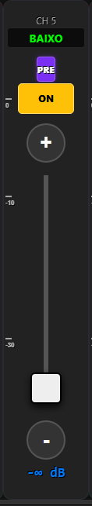

* **Controle de Volume e Fader Rail (Segurança Física):**
  * **Trilha Desabilitada para Toque:** A calha/trilho do fader é desabilitada para toques diretos (sem salto ou pulo de volume ao tocar no curso da trilha).
  * **Modificação Exclusiva por Arrasto:** O volume de envio só é modificado arrastando ativamente o thumb/knob ou usando os botões de nudge (+/-), igual a uma mesa física de áudio.
* **Comportamento dos Nudges (+ e -):**
  * **Step por Toque:** Incremento/decremento de envio de **`0.50 dB`** por toque.
  * **Long Press (Auto-Repeat):** Ao segurar pressionado o botão `(+)` ou `(-)`, o volume de envio se move continuamente acelerando enquanto mantido.

```text
┌──────────────────────────────────────────────┐
│                     CH 5                     │  <-- Zona 1 (Header do Canal de Entrada)
├──────────────────────────────────────────────┤  ═════════════════════════════════════════
│                  [ BAIXO ]                   │  ▲ [TOPO]: VERMELHO (PEAK)
├──────────────────────────────────────────────┤  │
│                   [ PRE ]                    │  │ [ALTO]: AMARELO
├──────────────────────────────────────────────┤  │
│                     [ON]                     │  │ CORTINA VU METER DE FUNDO INTEGRAL
├──────────────────────────────────────────────┤  │ (Preenche 100% da área útil do card;
│                     (+)                      │  │  em -∞ dB repousa na base)
│                      │                       │  │ <-- Nudge (+0.50 dB / Long Press)
│    0 ───             │                       │  │
│  -10 ───             │                       │  │
│  -30 ───             │                       │  │
│                    [ █ ] ◄─ Arraste do Thumb │  │ ⚠️ Trilho desabilitado p/ toque direto
│                     (-)                      │  │ <-- Nudge (-0.50 dB / Long Press)
├──────────────────────────────────────────────┤  ▼ [BASE]: VERDE PURO
│                   -∞ dB                      │  <-- Zona 6 (Nível de Envio Atenuado)
└──────────────────────────────────────────────┘  ═════════════════════════════════════════
```

#### 5. Macro Fader Técnico (`MACRO` / `MACRO FADER`)
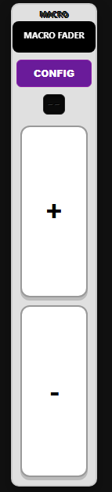

* **Comportamento dos Big Nudges (+ e -):**
  * **Step por Toque:** Incremento/decremento coletivo de **`0.05 dB`** por toque nos canais selecionados.
  * **Long Press (Auto-Repeat):** Ao segurar pressionado `(+)` ou `(-)`, a variação delta dB corre continuamente acelerando enquanto mantido.

```text
┌──────────────────────────────────────────────┐  <-- Fundo Cinza Claro / Prateado
│                    MACRO                     │  <-- Zona 1 (Header Centralizado)
├──────────────────────────────────────────────┤
│                [MACRO FADER]                 │  <-- Zona 3 (Display do Macro)
├──────────────────────────────────────────────┤
│                  [ CONFIG ]                  │  <-- Zona 4 (Botão Roxo Seletor CHs)
├──────────────────────────────────────────────┤
│                    [--]                      │  <-- Zona 4 (Visor Preto Delta dB)
├──────────────────────────────────────────────┤
│ ┌──────────────────────────────────────────┐ │
│ │                                          │ │
│ │                    +                     │ │  <-- Zona 6 (Big Nudge: +0.05 dB / Long Press)
│ │                                          │ │
│ └──────────────────────────────────────────┘ │
│ ┌──────────────────────────────────────────┐ │
│ │                                          │ │
│ │                    -                     │ │  <-- Zona 6 (Big Nudge: -0.05 dB / Long Press)
│ │                                          │ │
│ └──────────────────────────────────────────┘ │
└──────────────────────────────────────────────┘
```

#### 6. Volume Geral de AUX (`AUX` / `AUX GERAL`)
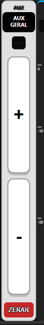

* **Comportamento dos Big Nudges (+ e -):**
  * **Step por Toque:** Incremento/decremento de envio geral de **`0.10 dB`** por toque para todos os canais no auxiliar.
  * **Long Press (Auto-Repeat):** Ao segurar pressionado `(+)` ou `(-)`, o envio coletivo corre continuamente acelerando.

```text
┌──────────────────────────────────────────────┐  <-- Fundo Cinza Claro / Prateado
│                     AUX                      │  <-- Zona 1 (Header Centralizado)
├──────────────────────────────────────────────┤
│                 [AUX GERAL]                  │  <-- Zona 3 (Display do AUX Geral)
├──────────────────────────────────────────────┤
│                    [--]                      │  <-- Zona 4 (Visor Preto Delta dB)
├──────────────────────────────────────────────┤
│ ┌──────────────────────────────────────────┐ │
│ │                                          │ │
│ │                    +                     │ │  <-- Zona 6 (Big Nudge: +0.10 dB / Long Press)
│ │                                          │ │
│ └──────────────────────────────────────────┘ │
│ ┌──────────────────────────────────────────┐ │
│ │                                          │ │
│ │                    -                     │ │  <-- Zona 6 (Big Nudge: -0.10 dB / Long Press)
│ │                                          │ │
│ └──────────────────────────────────────────┘ │
├──────────────────────────────────────────────┤
│                  [ ZERAR ]                   │  <-- Zona 7 (Botão Vermelho Reset Envios)
└──────────────────────────────────────────────┘
```

#### 7. Volume Geral do Músico (`GERAL` / `VOLUME GERAL`)
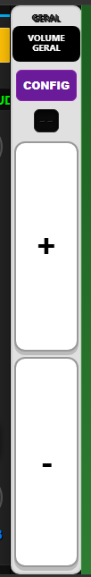

* **Comportamento dos Big Nudges (+ e -):**
  * **Step por Toque:** Incremento/decremento master de monitor de **`0.25 dB`** por toque.
  * **Long Press (Auto-Repeat):** Ao segurar pressionado `(+)` ou `(-)`, o volume geral do fone corre continuamente acelerando.

```text
┌──────────────────────────────────────────────┐  <-- Fundo Cinza Claro / Prateado
│                    GERAL                     │  <-- Zona 1 (Header Centralizado)
├──────────────────────────────────────────────┤
│                [VOLUME GERAL]                │  <-- Zona 3 (Display Modo Músico)
├──────────────────────────────────────────────┤
│                  [ CONFIG ]                  │  <-- Zona 4 (Botão Roxo Configuração)
├──────────────────────────────────────────────┤
│                    [--]                      │  <-- Zona 4 (Visor Preto Delta dB)
├──────────────────────────────────────────────┤
│ ┌──────────────────────────────────────────┐ │
│ │                                          │ │
│ │                    +                     │ │  <-- Zona 6 (Big Nudge: +0.25 dB / Long Press)
│ │                                          │ │
│ └──────────────────────────────────────────┘ │
│ ┌──────────────────────────────────────────┐ │
│ │                                          │ │
│ │                    -                     │ │  <-- Zona 6 (Big Nudge: -0.25 dB / Long Press)
│ │                                          │ │
│ └──────────────────────────────────────────┘ │
└──────────────────────────────────────────────┘
```

#### 8. Canal Mobile TRAVADO / LOCKED (`CH 8` / `VIOL AGUDO`)
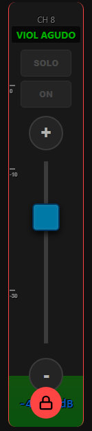

* **Controle de Volume e Fader Rail (Segurança Física):**
  * **Trilha Desabilitada para Toque:** A calha/trilho do fader é desabilitada para toques diretos (sem salto ou pulo de volume ao tocar no curso da trilha).
  * **Modificação Exclusiva por Arrasto:** O volume só é modificado arrastando ativamente o thumb/knob (quando destravado) ou usando os nudges (+/-), igual a uma mesa física.
* **Comportamento dos Nudges (+ e -):**
  * **Quando Destravado:** Step de **`0.05 dB`** com Long Press acelerado.
  * **Quando Travado:** Bloqueado contra toques acidentais.
* **Visual Mobile:**
  * Borda perimetral sutil em **Vermelho** contornando todo o card (`border: 1px solid #ff4444`).
  * Card escurecido com overlay de bloqueio total de ponteiro.
  * **Badge Circular Vermelho com Cadeado (`🔒`)** centralizado no rodapé inferior.
* **Interação Mobile (Gestos Tácteis & Modais):**
  * **Quando DESTRAVADO (Unlocked):**
    * *Toque Rápido no Topo:* Abre a tela normal de configuração do canal.
    * *Long Press no Topo ou Toque no Badge:* Abre modal com opções `[SIM, TRAVAR]`, `[RENOMEAR CANAL]` e `[CANCELAR]`.
    * *Arrasto (> 10px):* Cancela o long press e permite scroll fluido da lista de canais.
  * **Quando TRAVADO (Locked):**
    * *Toque Normal em qualquer área:* Exibe modal de desbloqueio.
    * *Long Press em qualquer área:* Também exibe o modal de desbloqueio.
    * *Toque no Cadeado Vermelho Inferior:* Dispara imediatamente a confirmação de destravamento.

```text
┌──────────────────────────────────────────────┐  <-- Borda Vermelha de Travamento
│                     CH 8                     │  <-- Zona 1 (Header Escurecido)
├──────────────────────────────────────────────┤  ░░░░░░░░░░░░░░░░░░░░░░░░░░░░░░░░░░
│                [ VIOL AGUDO ]                │  ░
├──────────────────────────────────────────────┤  ░
│                    [SOLO]                    │  ░
├──────────────────────────────────────────────┤  ░ INTERFACE MOBILE BLOQUEADA
│                     [ON]                     │  ░ (Prevenção total contra toques
├──────────────────────────────────────────────┤  ░  acidentais no palco/bolso)
│                     (+)                      │  ░ <-- Nudge Bloqueado
│                      │                       │  ░
│    0 ───             │                       │  ░
│                    [ █ ] ◄─ Fader Protegido  │  ░ ⚠️ Trilho desabilitado p/ toque direto
│  -10 ───             │                       │  ░
│                      │                       │  ░
│  -30 ───             │                       │  ░
│        ▓▓▓▓▓▓▓▓▓▓▓▓▓▓│▓▓▓▓▓▓▓▓▓▓▓▓▓▓         │  ░ ◄── VU Meter continua ativo no fundo
│                     (-)                      │  ░ <-- Nudge Bloqueado
├─────────────────────┬───┬────────────────────┤  ░░░░░░░░░░░░░░░░░░░░░░░░░░░░░░░░░░
│                   -4│ 🔒 │dB                 │  <-- Badge Vermelho Circular (🔒)
└─────────────────────┴───┴────────────────────┘      (Toque / Long Press p/ Destravar)
```

#### 9. Canal Mobile DESABILITADO / DISABLED (Ex: Modo FIXED)
* **Comportamento Idêntico ao Hardware da Mesa:**
  * Fader, réguas, displays e nudges ficam **completamente acinzentados (desaturados/opacidade reduzida)** e **sem ação de toque**.
  * **EXCEÇÃO CRÍTICA — Botão ON (Mute):** O botão **ON** permanece com sua **cor normal e 100% funcional**, permitindo ligar/desligar o envio normalmente.

```text
┌──────────────────────────────────────────────┐  <-- Visual Acinzentado / Desaturado
│                    AUX 1                     │  <-- Zona 1 (Header Acinzentado)
├──────────────────────────────────────────────┤
│                   [ AUX1 ]                   │  <-- Zona 3 (Display Desaturado)
├──────────────────────────────────────────────┤
│                   [FIXED]                    │  <-- Zona 2 (Status FIXED)
├──────────────────────────────────────────────┤
│                     [ON]                     │  <-- Zona 5: 100% ATIVO & COLORIDO!
├──────────────────────────────────────────────┤      (Permite Mute/Unmute normalmente)
│                     (+)  (inativo)           │
│                      │                       │
│    0 ───           [ █ ] ◄─ Fader 0 dB Fixo  │  <-- Fader Desabilitado p/ toque
│  -10 ───             │                       │
│  -30 ───             │                       │
│                     (-)  (inativo)           │
├──────────────────────────────────────────────┤
│                   0.00 dB                    │  <-- Zona 6 (Leitura Fixa)
└──────────────────────────────────────────────┘
```

---

### 3.3 Catálogo Visual e Estrutural das Variações Desktop (`docs/imgs/`)

No layout Desktop, a largura é fixa/padronizada em **85px** (para canais individuais) e **108px** (para canais pareados/linked), e a verticalidade acomoda a régua analógica completa, botões de nudge dedicados (+ e - de micro-ajuste), barra(s) de VU meter independentes com LED de PEAK circular e o panpot analógico de rodapé.

* **Canais Colados / Sem Espaçamento no Desktop (`gap: 0`):**
  * Diferente do Mobile, no modo **Desktop** todos os channel strips são **completamente colados uns aos outros (espaçamento zero / `gap: 0` / sem margem entre strips)** com largura individual de **85px** (ou **108px** quando LINKED), exatamente como as faixas de canais contíguas em uma console física de mixagem tradicional, maximizando a densidade visual e permitindo visualizar até 32 canais lado a lado no monitor.

  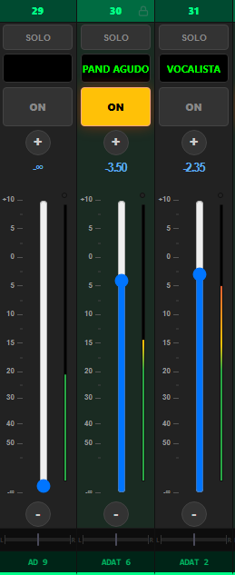

#### 1. Canal de Input Mono (`CH 1` a `16` em Azul / `CH 17` a `32` em Esverdeado) (CONCLUÍDO ✅)
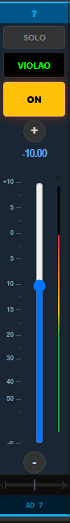

* **Diferenciação Cromática de Faixas:**
  * **Canais 1 a 16:** Identidade visual com Header e acentos em **Tom Azul Yamaha** (`#0088cc`).
  * **Canais 17 a 32:** Identidade visual com Header e acentos em **Tom Esverdeado** (`#00a86b`) para rápida distinção das camadas físicas.
* **Controle de Volume e Fader Rail (Segurança Física & Mouse Wheel):**
  * **Trilha Desabilitada para Clique:** A calha/trilho do fader é desabilitada para cliques diretos (sem salto ou pulo de volume ao clicar ao longo do curso da trilha).
  * **Modificação Exclusiva por Arrasto ou Wheel:** O volume só é modificado arrastando o thumb/knob, usando os botões de nudge (+/-), ou girando a **roda do mouse (*scroll wheel*) sobre o thumb/trilho** para aumentar/diminuir com step de **`0.10 dB`** por entalhe da roda, exatamente como em uma mesa física de áudio.
* **Comportamento dos Nudges (+ e -):**
  * **Step por Clique:** Incremento/decremento fino de **`0.05 dB`** por clique.
  * **Long Press (Auto-Repeat):** Ao manter o botão do mouse pressionado sobre `(+)` ou `(-)`, o volume se move continuamente acelerando.
* **Mecânica do LED de PEAK (`.desk-peak-led`):**
  * Localizado logo acima do VU meter (topo da calha).
  * Em repouso/sinal normal: círculo discreto escuro (`#252525`, borda `#111`).
  * Em $\ge 98\%$ de sinal: acende em **Vermelho Vivo** (`.active`, `background: #ff0000; box-shadow: 0 0 8px #ff4444;`) com **Peak Hold de 1000 ms (1 segundo)** após o sinal baixar.

```text
┌──────────────────────────────────────────────┐
│ [ ]                 7                    [ ] │  <-- Zona 1 (Tripartite: Slot / CH Azul / Slot)
├──────────────────────────────────────────────┤
│                    [SOLO]                    │  <-- Zona 2 (Botão Solo)
├──────────────────────────────────────────────┤
│                 [ VIOLAO ]                   │  <-- Zona 3 (Display OLED Verde Neon)
├──────────────────────────────────────────────┤
│                     [ON]                     │  <-- Zona 5 (Botão ON Amarelo Ativo)
├──────────────────────────────────────────────┤
│                     (+)                      │  <-- Zona 5 (Nudge: +0.05 dB / Long Press)
│                   -10.00                     │  <-- Zona 6 (Leitura Numérica em dB)
│                                              │
│  +10 ───          │  │                  (o)  │  <-- PEAK LED Circular (.desk-peak-led)
│                   │  │                   │   │
│    5 ───          │  │                   │   │
│                   │  │                   │   │  ▲ [TOPO]: Vermelho
│    0 ───          │  │                   │   │  │
│                   │  │                   │   │  │ BARRA DE VU METER
│    5 ───          │  │                   │   │  │ DEDICADA 60 FPS
│                   │██│ ◄─ Arraste / Wheel│   │  │ (Trilho desabilitado p/ clique direto)
│   10 ───          │██│    (Thumb Fader)  │   │  │ [MÉDIO]: Amarelo
│                   │██│                   │   │  │ [BASE]: Verde
│   15 ───          │  │                   │   │  ▼
│   20 ───          │  │                   │   │
│   30 ───          │  │                   │   │
│   40 ───          │  │                   │   │
│   50 ───          │  │                  ░│   │  ◄── Barra de VU Subindo
│   -∞ ───          │  │                  ▓│   │
│                                              │
│                     (-)                      │  <-- Zona 6 (Nudge: -0.05 dB / Long Press)
├──────────────────────────────────────────────┤
│  L ───────────────[ | ]─────────────────── R │  <-- Zona 7 (Panpot Analógico L-C-R)
├──────────────────────────────────────────────┤
│                    AD 7                      │  <-- Zona 7 (Patch I/O Físico)
└──────────────────────────────────────────────┘
```

---

#### 2. Canal Pareado / Linkado (`CH 21 + 22` / `TECLADO`) (CONCLUÍDO ✅)
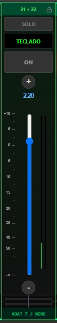

* **Moldura:** Contorno verde neon em todo o card duplo.
* **Zona 1:** Cabeçalho tripartite com ícone de cadeado 🔒 (`21 + 22 [🔒]`).
* **Controle de Volume e Fader Rail (Segurança Física & Mouse Wheel):**
  * **Trilha Desabilitada para Clique:** A calha/trilho do fader é desabilitada para cliques diretos (sem salto ou pulo de volume).
  * **Modificação Exclusiva por Arrasto ou Wheel:** O volume só é modificado arrastando o thumb/knob, usando os botões de nudge (+/-), ou girando a **roda do mouse (*scroll wheel*) sobre o thumb/trilho** com step de **`0.10 dB`** por entalhe para aumentar/diminuir, igual a uma mesa física.
* **Comportamento dos Nudges (+ e -):**
  * **Step por Clique:** Incremento/decremento de **`0.05 dB`** por clique atuando em ambos os canais pareados.
  * **Long Press (Auto-Repeat):** Ao manter o botão do mouse pressionado sobre `(+)` ou `(-)`, o volume se move continuamente acelerando.
* **Zona 6 (VU Meter Estéreo Duplo):** **Duas barras verticais de VU Meter paralelas (L e R)** com seus respectivos LEDs circulares de Peak.
* **Zona 7 (Duplo Pan com 2 Trilhas Independentes & Marquee):** **Duas barras/trilhas físicas de Panpot empilhadas (L no topo e R embaixo)**, cada uma com seu próprio cursor deslizante, e Badge de Patch com efeito marquee caso o texto (`ADAT 7 / NONE`) exceda a largura.

```text
┌──────────────────────────────────────────────┐  <-- Borda Verde de Pareamento
│ [ ]               21 + 22                [🔒]│  <-- Zona 1 (Header Verde com Cadeado)
├──────────────────────────────────────────────┤
│                    [SOLO]                    │  <-- Zona 2 (Botão Solo)
├──────────────────────────────────────────────┤
│                 [ TECLADO ]                  │  <-- Zona 3 (Display OLED Integrado)
├──────────────────────────────────────────────┤
│                     [ON]                     │  <-- Zona 5 (Botão ON)
├──────────────────────────────────────────────┤
│                     (+)                      │  <-- Zona 5 (Nudge: +0.05 dB / Long Press)
│                    2.20                      │  <-- Zona 6 (Leitura dB)
│                                              │
│  +10 ───          │  │                 (o)(o)│  <-- Duplo PEAK LED Estéreo
│                   │██│ ◄─ Arraste/Wheel │  │ │  (Trilho desabilitado p/ clique direto)
│    5 ───          │██│    (Thumb Fader) │  │ │  ▲
│                   │██│                  │  │ │  │
│    0 ───          │  │                  │  │ │  │ DUPLO VU METER ESTÉREO
│                   │  │                  │  │ │  │ (Barra L e Barra R)
│    5 ───          │  │                  │  │ │  │
│   10 ───          │  │                  │  │ │  │
│   20 ───          │  │                  │  │ │  ▼
│   30 ───          │  │                  │  │ │
│   40 ───          │  │                  │  │ │
│   50 ───          │  │                 ░│ ░│ │  ◄── Nível L / R Independentes
│   -∞ ───          │  │                 ▓│ ▓│ │
│                                              │
│                     (-)                      │  <-- Zona 6 (Nudge: -0.05 dB / Long Press)
├──────────────────────────────────────────────┤
│  L ───────────────[ | ]─────────────────── R │  <-- Trilha Pan Canal Ímpar (L)
│  L ───────────────[ | ]─────────────────── R │  <-- Trilha Pan Canal Par (R)
├──────────────────────────────────────────────┤
│               ADAT 7 / NONE                  │  <-- Zona 7 (Patch com Efeito Marquee)
└──────────────────────────────────────────────┘
```

---

#### 3. Master Fader Stereo (`MASTER` / `ST`)
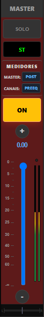

* **Identidade Visual:** Fundo Vinho / Borgonha escuro (`#3d1313`, borda `#800`).
* **Zona 4 (Painel de Medidores Exclusivo):** Seletores de derivação de sinal:
  * `MASTER: [ POST ]` (Post-fader / Pre-fader)
  * `CANAIS: [ PREEQ ]` (Pre-EQ / Post-EQ / Pre-fader / Post-fader)
* **Controle de Volume e Fader Rail (Segurança Física & Mouse Wheel):**
  * **Trilha Desabilitada para Clique:** A calha/trilho do fader é desabilitada para cliques diretos (sem salto ou pulo de volume).
  * **Modificação Exclusiva por Arrasto ou Wheel:** O volume master só é modificado arrastando o thumb/knob, usando os botões de nudge (+/-), ou girando a **roda do mouse (*scroll wheel*) sobre o thumb/trilho** com step de **`0.10 dB`** por entalhe para aumentar/diminuir (seguindo o padrão dos canais de input), igual a uma mesa física.
* **Comportamento dos Nudges (+ e -):**
  * **Step por Clique:** Incremento/decremento fino de **`0.05 dB`** por clique no Master Stereo.
  * **Long Press (Auto-Repeat):** Ao manter pressionado `(+)` ou `(-)`, o volume se move continuamente acelerando em alta velocidade.
* **Zona 6 (VU Meter Master L/R):** Duplo VU Meter estéreo com escala ampla e Peak LEDs independentes.

```text
┌──────────────────────────────────────────────┐  <-- Fundo Vinho / Borgonha (#3d1313)
│ [ ]                MASTER                [ ] │  <-- Zona 1 (Header Master)
├──────────────────────────────────────────────┤
│                    [SOLO]                    │  <-- Zona 2 (Solo / Clear All Solos)
├──────────────────────────────────────────────┤
│                    [ ST ]                    │  <-- Zona 3 (Display OLED Neon)
├──────────────────────────────────────────────┤
│                 MEDIDORES                    │  <-- Zona 4 (Bloco de Medidores)
│             MASTER:  [ POST  ]               │
│             CANAIS:  [ PREEQ ]               │
├──────────────────────────────────────────────┤
│                     [ON]                     │  <-- Zona 5 (Botão ON Amarelo)
├──────────────────────────────────────────────┤
│                     (+)                      │  <-- Zona 5 (Nudge: +0.05 dB / Long Press)
│                    0.00                      │  <-- Zona 6 (Leitura dB)
│                                              │
│    0 ───          │██│ ◄─ Arraste/Wheel(o)(o)│  <-- Duplo PEAK LED
│                   │██│    (Thumb Fader) │  │ │  (Trilho desabilitado p/ clique direto)
│    5 ───          │  │                  │  │ │  ▲
│   10 ───          │  │                  │  │ │  │ DUPLO VU METER ESTÉREO
│   15 ───          │  │                  │  │ │  │ MASTER (L e R)
│   20 ───          │  │                 ▓│ ▓│ │  │
│   25 ───          │  │                 ▓│ ▓│ │  ▼
│   30 ───          │  │                 ▓│ ▓│ │
│   40 ───          │  │                 ▓│ ▓│ │
│   50 ───          │  │                 ▓│ ▓│ │
│   60 ───          │  │                 ▓│ ▓│ │
│   -∞ ───          │  │                 ▓│ ▓│ │
│                                              │
│                     (-)                      │  <-- Zona 6 (Nudge: -0.05 dB / Long Press)
├──────────────────────────────────────────────┤
│  L ───────────────[ | ]─────────────────── R │  <-- Zona 7 (Panpot Master Central)
└──────────────────────────────────────────────┘
```

---

#### 4. Macro Fader Técnico (`MACRO` / `MACRO FADER`)
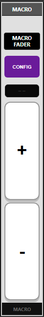

* **Identidade Visual:** Fundo Cinza Claro / Prateado metálico (`#e0e0e0`).
* **Zona 4:** Botão roxo **`[ CONFIG ]`** (abre modal para selecionar canais controlados) + Visor OLED de **Delta dB** (`--` em repouso / `+2.00 dB` ao agir).
* **Comportamento dos Big Nudges (+ e -):**
  * **Step por Clique:** Incremento/decremento coletivo de **`0.05 dB`** por clique nos canais selecionados (*sem suporte a roda do mouse*).
  * **Long Press (Auto-Repeat):** Ao manter pressionado `(+)` ou `(-)`, a variação delta dB corre continuamente acelerando.
* **Zona 6 (Big Nudges):** Botões retangulares brancos de grande área útil `[ + ]` e `[ - ]` com auto-repeat acelerado para compensação de ganho em bloco.

```text
┌──────────────────────────────────────────────┐  <-- Fundo Cinza Claro / Metálico
│                    MACRO                     │  <-- Zona 1 (Header Escuro)
├──────────────────────────────────────────────┤
│                [MACRO FADER]                 │  <-- Zona 3 (Display OLED)
├──────────────────────────────────────────────┤
│                  [ CONFIG ]                  │  <-- Zona 4 (Botão Roxo Configuração)
├──────────────────────────────────────────────┤
│                    [--]                      │  <-- Zona 4 (Visor Delta dB)
├──────────────────────────────────────────────┤
│ ┌──────────────────────────────────────────┐ │
│ │                                          │ │
│ │                    +                     │ │  <-- Zona 6 (Big Nudge: +0.05 dB / Long Press)
│ │                                          │ │
│ └──────────────────────────────────────────┘ │
│ ┌──────────────────────────────────────────┐ │
│ │                                          │ │
│ │                    -                     │ │  <-- Zona 6 (Big Nudge: -0.05 dB / Long Press)
│ │                                          │ │
│ └──────────────────────────────────────────┘ │
├──────────────────────────────────────────────┤
│                    MACRO                     │  <-- Zona 7 (Rodapé Escuro)
└──────────────────────────────────────────────┘
```

---

#### 5. Canais MIX / Saídas Auxiliares Mono (`MIX 2` / `AUX2`)
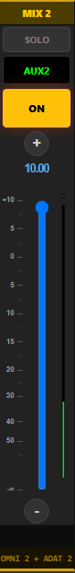

* **Identidade Visual:** Header em tom Amarelo Dourado / Âmbar (`#d4af37`).
* **Controle de Volume e Fader Rail (Segurança Física & Mouse Wheel):**
  * **Trilha Desabilitada para Clique:** A calha/trilho do fader é desabilitada para cliques diretos (sem salto ou pulo de volume).
  * **Modificação Exclusiva por Arrasto ou Wheel:** O volume só é modificado arrastando o thumb/knob, usando os botões de nudge (+/-), ou girando a **roda do mouse (*scroll wheel*) sobre o thumb/trilho** com step de **`0.50 dB`** por entalhe para aumentar/diminuir, igual a uma mesa física.
* **Comportamento dos Nudges (+ e -):**
  * **Step por Clique:** Incremento/decremento de **`0.10 dB`** por clique nas saídas MIX.
  * **Long Press (Auto-Repeat):** Ao manter pressionado `(+)` ou `(-)`, o volume se move continuamente acelerando.
* **Zona 7 (Roteamento Físico Duplo OMNI + ADAT):**
  
  * **MIX 1 a 4:** Possui saída física espelhada dupla: **`OMNI X + ADAT X`** (ex: `OMNI 2 + ADAT 2`).
  * **MIX 5 a 8:** Saída física direta padrão: **`ADAT 5` a `ADAT 8`**.
  * Texto com efeito **Marquee contínuo** quando ultrapassa a largura física do strip.

```text
┌──────────────────────────────────────────────┐
│ [ ]                MIX 2                 [ ] │  <-- Zona 1 (Header Âmbar / Amarelo)
├──────────────────────────────────────────────┤
│                    [SOLO]                    │  <-- Zona 2 (Botão Solo)
├──────────────────────────────────────────────┤
│                   [ AUX2 ]                   │  <-- Zona 3 (Display OLED)
├──────────────────────────────────────────────┤
│                     [ON]                     │  <-- Zona 5 (Botão ON)
├──────────────────────────────────────────────┤
│                     (+)                      │  <-- Zona 5 (Nudge: +0.10 dB / Long Press)
│                    10.00                     │  <-- Zona 6 (Leitura dB)
│                                              │
│  +10 ───          │██│ ◄─ Arraste/Wheel (o)  │  <-- PEAK LED
│                   │██│    (Thumb Fader)  │   │  (Trilho desabilitado p/ clique direto)
│    5 ───          │  │                   │   │
│    0 ───          │  │                   │   │  ▲ VU METER MONO
│    5 ───          │  │                   │   │  │ (MIX Output)
│   10 ───          │  │                   │   │  ▼
│   20 ───          │  │                   │   │
│   30 ───          │  │                   │   │
│   40 ───          │  │                  ░│   │
│   50 ───          │  │                  ▓│   │
│   -∞ ───          │  │                  ▓│   │
│                                              │
│                     (-)                      │  <-- Zona 6 (Nudge: -0.10 dB / Long Press)
├──────────────────────────────────────────────┤
│               OMNI 2 + ADAT 2                │  <-- Zona 7 (Saída Dupla com Marquee)
└──────────────────────────────────────────────┘
```

---

#### 6. Barramento BUS Pareado (`BUS 1 + 2` / `VHIGH`)
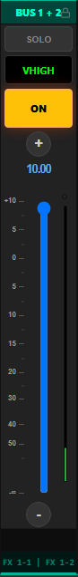

* **Identidade Visual:** Header em tom Ciano / Verde-Azulado com ícone de cadeado 🔒 (`BUS 1 + 2 [🔒]`).
* **Controle de Volume e Fader Rail (Segurança Física & Mouse Wheel):**
  * **Trilha Desabilitada para Clique:** A calha/trilho do fader é desabilitada para cliques diretos (sem salto ou pulo de volume).
  * **Modificação Exclusiva por Arrasto ou Wheel:** O volume só é modificado arrastando o thumb/knob, usando os botões de nudge (+/-), ou girando a **roda do mouse (*scroll wheel*) sobre o thumb/trilho** com step de **`0.50 dB`** por entalhe para aumentar/diminuir, igual a uma mesa física.
* **Comportamento dos Nudges (+ e -):**
  * **Step por Clique:** Incremento/decremento de **`0.10 dB`** por clique no barramento BUS.
  * **Long Press (Auto-Repeat):** Ao manter pressionado `(+)` ou `(-)`, o volume se move continuamente acelerando.
* **Correção de Especificação de VU (Stereo Dual Bar):**
  * *Correção em relação ao legado:* No legado aparecia erroneamente com apenas 1 barra. Na nova arquitetura universal, **todo BUS pareado, Input pareado ou canal estéreo obrigatoriamente renderiza 2 barras de VU meter (L e R)** e duplo LED de Peak.
* **Zona 7:** Patch duplo com divisória `FX 1-1 | FX 1-2`.

```text
┌──────────────────────────────────────────────┐
│ [ ]              BUS 1 + 2               [🔒]│  <-- Zona 1 (Header Ciano com Cadeado)
├──────────────────────────────────────────────┤
│                    [SOLO]                    │  <-- Zona 2 (Botão Solo)
├──────────────────────────────────────────────┤
│                  [ VHIGH ]                   │  <-- Zona 3 (Display OLED)
├──────────────────────────────────────────────┤
│                     [ON]                     │  <-- Zona 5 (Botão ON)
├──────────────────────────────────────────────┤
│                     (+)                      │  <-- Zona 5 (Nudge: +0.10 dB / Long Press)
│                    10.00                     │  <-- Zona 6 (Leitura dB)
│                                              │
│  +10 ───          │██│ ◄─ Arraste/Wheel(o)(o)│  <-- Duplo PEAK LED Estéreo
│                   │██│    (Thumb Fader) │  │ │  (Trilho desabilitado p/ clique direto)
│    5 ───          │  │                  │  │ │  ▲
│    0 ───          │  │                  │  │ │  │ DUPLO VU METER ESTÉREO
│    5 ───          │  │                  │  │ │  │ (Correção obrigatória: 2 barras)
│   10 ───          │  │                  │  │ │  ▼
│   20 ───          │  │                  │  │ │
│   30 ───          │  │                  │  │ │
│   40 ───          │  │                  │  │ │
│   50 ───          │  │                 ░│ ░│ │
│   -∞ ───          │  │                 ▓│ ▓│ │
│                                              │
│                     (-)                      │  <-- Zona 6 (Nudge: -0.10 dB / Long Press)
├──────────────────────────────────────────────┤
│              FX 1-1 | FX 1-2                 │  <-- Zona 7 (Patch BUS Duplo)
└──────────────────────────────────────────────┘
```

---

#### 7. Canais ST IN (Stereo In 1 a 4 - `ST IN 1` / `REVERB VOZ`)
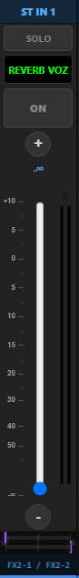

* **Zona 1:** Header azul `ST IN 1`.
* **Controle de Volume e Fader Rail (Segurança Física & Mouse Wheel):**
  * **Trilha Desabilitada para Clique:** A calha/trilho do fader é desabilitada para cliques diretos (sem salto ou pulo de volume).
  * **Modificação Exclusiva por Arrasto ou Wheel:** O volume só é modificado arrastando o thumb/knob, usando os botões de nudge (+/-), ou girando a **roda do mouse (*scroll wheel*) sobre o thumb/trilho** com step de **`0.10 dB`** por entalhe para aumentar/diminuir, igual a uma mesa física.
* **Comportamento dos Nudges (+ e -):**
  * **Step por Clique:** Incremento/decremento fino de **`0.05 dB`** por clique.
  * **Long Press (Auto-Repeat):** Ao manter pressionado `(+)` ou `(-)`, o volume se move continuamente acelerando.
* **Zona 6:** Fader estéreo com **duplo VU Meter L/R** e Peak LEDs.
* **Zona 7 (Duplo Pan Estéreo com 2 Barras):** **Duas barras/trilhas físicas de Panpot independentes (uma sobre a outra)** — o cursor de cima para o canal Left (ex: roxo `[L]` na ponta esquerda) e o cursor de baixo para o canal Right (ex: roxo `[R]` na ponta direita) + Patch estéreo `FX2-1 / FX2-2`.

```text
┌──────────────────────────────────────────────┐
│ [ ]               ST IN 1                [ ] │  <-- Zona 1 (Header ST IN Azul)
├──────────────────────────────────────────────┤
│                    [SOLO]                    │  <-- Zona 2 (Botão Solo)
├──────────────────────────────────────────────┤
│               [ REVERB VOZ ]                 │  <-- Zona 3 (Display OLED)
├──────────────────────────────────────────────┤
│                     [ON]                     │  <-- Zona 5 (Botão ON)
├──────────────────────────────────────────────┤
│                     (+)                      │  <-- Zona 5 (Nudge: +0.05 dB / Long Press)
│                     -∞                       │  <-- Zona 6 (Leitura dB)
│                                              │
│  +10 ───          │  │                 (o)(o)│  <-- Duplo PEAK LED
│    5 ───          │  │                  │  │ │
│    0 ───          │  │                  │  │ │  ▲ DUPLO VU METER ESTÉREO
│    5 ───          │  │                  │  │ │  │ (Retorno de Efeito / Estéreo)
│   10 ───          │  │                  │  │ │  ▼
│   20 ───          │  │                  │  │ │
│   30 ───          │  │                  │  │ │
│   40 ───          │  │                  │  │ │
│   50 ───          │  │                  │  │ │
│   -∞ ───          │██│ ◄─ Arraste/Wheel │  │ │  (Trilho desabilitado p/ clique direto)
│                   │  │    (Thumb Fader) │  │ │
│                     (-)                      │  <-- Zona 6 (Nudge: -0.05 dB / Long Press)
├──────────────────────────────────────────────┤
│  L ───[ L ]───────────────────────────────── │  <-- Trilha Pan Canal Esquerdo (L)
│  ─────────────────────────────────[ R ]─── R │  <-- Trilha Pan Canal Direito (R)
├──────────────────────────────────────────────┤
│              FX2-1 / FX2-2                   │  <-- Zona 7 (Patch ST IN com Marquee)
└──────────────────────────────────────────────┘
```

---

#### 8. Canal em Modo Sends on Faders Individual (`AUX 4` / `AUX4`)
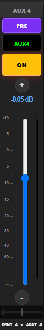

* **Zona 1:** Nome do barramento destino (`AUX 4`).
* **Zona 2 (Comutador PRE / POST):** Botão roxo **`[ PRE ]`** ou **`[ POST ]`** no lugar do botão SOLO para alternar a tomada de sinal do envio auxiliar.
* **Zona 3:** Nome do canal que está enviando (`AUX4`).
* **Controle de Volume e Fader Rail (Segurança Física & Mouse Wheel):**
  * **Trilha Desabilitada para Clique:** A calha/trilho do fader é desabilitada para cliques diretos (sem salto ou pulo de volume).
  * **Modificação Exclusiva por Arrasto ou Wheel:** O volume de envio só é modificado arrastando o thumb/knob, usando os botões de nudge (+/-), ou girando a **roda do mouse (*scroll wheel*) sobre o thumb/trilho** com step de **`0.50 dB`** por entalhe para aumentar/diminuir, igual a uma mesa física.
* **Comportamento dos Nudges (+ e -):**
  * **Step por Clique:** Incremento/decremento de envio de **`0.50 dB`** por clique.
  * **Long Press (Auto-Repeat):** Ao manter pressionado `(+)` ou `(-)`, o volume de envio corre continuamente acelerando.
* **Zona 6:** Leitura com sufixo (`-8.05 dB`), Fader vertical de envio, Régua completa e Barra de VU Meter com Peak LED.
* **Zona 7:** Panpot do envio + Saída física (`OMNI 4 + ADAT 4`) com efeito marquee.

```text
┌──────────────────────────────────────────────┐
│ [ ]                AUX 4                 [ ] │  <-- Zona 1 (Header do Envio Auxiliar)
├──────────────────────────────────────────────┤
│                   [ PRE ]                    │  <-- Zona 2 (Comutador Roxo PRE / POST)
├──────────────────────────────────────────────┤
│                   [ AUX4 ]                   │  <-- Zona 3 (Display OLED)
├──────────────────────────────────────────────┤
│                     [ON]                     │  <-- Zona 5 (Botão ON Amarelo)
├──────────────────────────────────────────────┤
│                     (+)                      │  <-- Zona 5 (Nudge: +0.50 dB / Long Press)
│                   -8.05 dB                   │  <-- Zona 6 (Leitura Numérica com dB)
│                                              │
│  +10 ───          │  │                  (o)  │  <-- PEAK LED
│    5 ───          │  │                   │   │
│    0 ───          │  │                   │   │  ▲ VU METER DO CANAL
│    5 ───          │  │                   │   │  │
│   10 ───          │██│ ◄─ Arraste/Wheel  │   │  ▼ (Trilho desabilitado p/ clique direto)
│   15 ───          │██│    (Thumb Fader)  │   │
│   20 ───          │  │                   │   │
│   30 ───          │  │                   │   │
│   40 ───          │  │                   │   │
│   50 ───          │  │                   │   │
│   -∞ ───          │  │                   │   │
│                                              │
│                     (-)                      │  <-- Zona 6 (Nudge: -0.50 dB / Long Press)
├──────────────────────────────────────────────┤
│  L ───────────────[ | ]─────────────────── R │  <-- Zona 7 (Panpot do Envio)
├──────────────────────────────────────────────┤
│               OMNI 4 + ADAT 4                │  <-- Zona 7 (Saída com Efeito Marquee)
└──────────────────────────────────────────────┘
```

---

#### 9. Macro de Envio Geral (`AUX GERAL` / `MIX GERAL`)
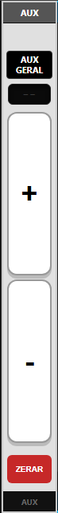

* Localizado na extremidade direita da tela de *Sends on Faders*:
  * **Zona 1 (Header):** `AUX` (ou `MIX` na tela de Mix Sends).
  * **Zona 3 (Display OLED):** `AUX GERAL` (ou `MIX GERAL`).
  * **Zona 4:** Visor OLED de Delta dB (`--`).
  * **Comportamento dos Big Nudges (+ e -):**
    * **Step por Clique:** Incremento/decremento de envio geral de **`0.10 dB`** por clique para todos os canais (*sem suporte a roda do mouse*).
    * **Long Press (Auto-Repeat):** Ao manter pressionado `(+)` ou `(-)`, a compensação coletiva corre continuamente acelerando.
  * **Zona 6 (Big Nudges):** Botões retangulares brancos `[ + ]` e `[ - ]` com auto-repeat acelerado para aumentar ou diminuir coletivamente o envio de todos os canais para aquele auxiliar.
  * **Zona 7 (Ação Crítica ZERAR):** Botão Vermelho de Destaque **`[ ZERAR ]`** (aciona modal de confirmação para zerar todos os envios de uma só vez) + Rodapé escuro `AUX` (ou `MIX`).

```text
┌──────────────────────────────────────────────┐  <-- Fundo Cinza Claro / Metálico
│                    AUX                       │  <-- Zona 1 (Header Escuro AUX ou MIX)
├──────────────────────────────────────────────┤
│                 [AUX GERAL]                  │  <-- Zona 3 (Display OLED)
├──────────────────────────────────────────────┤
│                    [--]                      │  <-- Zona 4 (Visor Delta dB)
├──────────────────────────────────────────────┤
│ ┌──────────────────────────────────────────┐ │
│ │                                          │ │
│ │                    +                     │ │  <-- Zona 6 (Big Nudge: +0.10 dB / Long Press)
│ │                                          │ │
│ └──────────────────────────────────────────┘ │
│ ┌──────────────────────────────────────────┐ │
│ │                                          │ │
│ │                    -                     │ │  <-- Zona 6 (Big Nudge: -0.10 dB / Long Press)
│ │                                          │ │
│ └──────────────────────────────────────────┘ │
├──────────────────────────────────────────────┤
│                  [ ZERAR ]                   │  <-- Zona 7 (Botão Vermelho Reset Envios)
├──────────────────────────────────────────────┤
│                    AUX                       │  <-- Zona 7 (Rodapé Escuro AUX ou MIX)
└──────────────────────────────────────────────┘
```

---

#### 9.1 Dock Lateral de Configuração (Mini-Fader Contextual & Master Auxiliar com Painel de POSIÇÃO)

* **Conceito Arquitetural:** O "Mini-Fader" **não é um componente separado**, mas sim a instância do próprio **`ChannelStrip` Universal** acoplado na lateral direita do modal (`#miniFaderContainer` / `#miniFaderContext`):
  * **Replicação Contextual:** Ao abrir a edição de qualquer canal (`CH 1-32`, `ST IN`, `BUS`, `MIX`, `MASTER`), o dock renderiza fielmente o canal selecionado, permitindo controle contínuo de volume, mute e solo.
  * **Comportamento Especial Solo Replace:** No Mini-Fader do modal, acionar SOLO substitui a seleção anterior de monitoração em vez de acumular.
  * **Renomeação In-Place:** O clique no display OLED (Zona 3) abre diretamente o `VirtualKeyboard`.
* **Caso Especial dos Auxiliares (`Sends on Faders` / `MIX 1-8`):**
  * Quando aberto na tela de envios de um auxiliar, o strip do Master do Auxiliar renderiza na **Zona 4** o **Painel de POSIÇÃO** (compartilhando 100% da mesma arquitetura modular do painel `MEDIDORES` do Master LR):
    * **Título:** `POSIÇÃO` (em tom âmbar/dourado `#d4af37`).
    * **Linha 1 (GLOBAL):** Rótulo `GLOBAL:` + Badge `[ PRE ]` / `[ POST ]` para alternar a tomada de sinal de envio.
    * **Linha 2 (PRE-P):** Rótulo `PRE-P:` + Badge `[ PRE ON ]` / `[ PRE FADER ]` para alternar o ponto Pre.
  * **Layout do Strip do Master Auxiliar no Dock:**

```text
┌──────────────────────────────────────────────┐
│ [ ]                 MIX 7                [ ] │  <-- Zona 1 (Header Âmbar MIX 7)
├──────────────────────────────────────────────┤
│                    [SOLO]                    │  <-- Zona 2 (Solo com Solo Replace)
├──────────────────────────────────────────────┤
│                   [ AUX7 ]                   │  <-- Zona 3 (Display OLED Verde)
├──────────────────────────────────────────────┤
│ ┌──────────────────────────────────────────┐ │
│ │                 POSIÇÃO                  │ │  <-- Zona 4 (Painel Modular de POSIÇÃO)
│ │ GLOBAL:  [   PRE   ]                     │ │      (Borda e título âmbar #d4af37,
│ │ PRE-P:   [ PRE ON  ]                     │ │       badges com texto azul neon)
│ └──────────────────────────────────────────┘ │
├──────────────────────────────────────────────┤
│                     [ON]                     │  <-- Zona 5 (Botão ON Amarelo Ativo)
├──────────────────────────────────────────────┤
│                     (+)                      │  <-- Zona 5 (Nudge: +0.10 dB / Long Press)
│                    10.00                     │  <-- Zona 6 (Leitura Numérica em dB)
│                                              │
│  +10 ───          │██│ ◄─ Arraste/Wheel      │  <-- PEAK LED Mono
│                   │██│    (Thumb Fader)  │   │  (Trilho desabilitado p/ clique direto)
│    5 ───          │  │                   │   │
│    0 ───          │  │                   │   │  ▲ VU METER MONO DO AUX
│    5 ───          │  │                   │   │  │
│   10 ───          │  │                  ░│   │  ▼
│   20 ───          │  │                  ▓│   │
│   30 ───          │  │                  ▓│   │
│   40 ───          │  │                  ▓│   │
│   50 ───          │  │                  ▓│   │
│   -∞ ───          │  │                  ▓│   │
│                                              │
│                     (-)                      │  <-- Zona 6 (Nudge: -0.10 dB / Long Press)
├──────────────────────────────────────────────┤
│                   ADAT 7                     │  <-- Zona 7 (Patch Sem Panpot)
└──────────────────────────────────────────────┘
```

---

#### 10. Canal Desktop TRAVADO / LOCKED (`CH 8` / `VIOL AGUDO`)
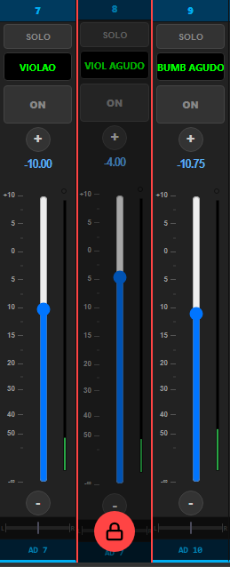

* **Controle de Volume e Fader Rail (Segurança Física & Mouse Wheel):**
  * **Trilha Desabilitada para Clique:** A calha/trilho do fader é desabilitada para cliques diretos (sem salto ou pulo de volume).
  * **Modificação Exclusiva por Arrasto ou Wheel:** Quando destravado, o volume só é modificado arrastando o thumb/knob, pelos nudges (+/-), ou girando a **roda do mouse (*scroll wheel*) sobre o thumb/trilho**.
* **Visual Desktop:**
  * Linhas laterais destacadas em **Vermelho** (`border-left: 2px solid #ff4444; border-right: 2px solid #ff4444;`).
  * Overlay protetor bloqueando cliques acidentais nos controles internos.
  * **Cadeado Vermelho Circular Grande** posicionado no rodapé central sobre o overlay.
* **Interação Desktop:**
  * **Para TRAVAR:** O operador clica no slot do cadeado na Zona 1 (Header).
  * **Para DESTRAVAR:** O operador clica diretamente no **Cadeado Vermelho Grande** do rodapé/overlay, abrindo a confirmação para destravar.

```text
┌──────────────────────────────────────────────┐  <-- Borda Lateral Vermelha (#ff4444)
│ [ ]                 8                    [🔒]│  <-- Zona 1 (Ícone Cadeado Ativo)
├──────────────────────────────────────────────┤
│                   [ SOLO ]                   │  ░░░░░░░░░░░░░░░░░░░░░░░░░░░░░░░░░░
├──────────────────────────────────────────────┤  ░
│                [ VIOL AGUDO ]                │  ░
├──────────────────────────────────────────────┤  ░
│                    [ ON ]                    │  ░ CONTROLES BLOQUEADOS
├──────────────────────────────────────────────┤  ░ POR OVERLAY PROTETOR
│                     (+)                      │  ░ (Fader, Solo, ON, Nudges,
│                    -4.00                     │  ░  Panpot e Patch protegidos)
│                                              │  ░
│  +10 ───          │  │                  (o)  │  ░
│    5 ───          │  │                   │   │  ░
│    0 ───          │  │                   │   │  ░
│    5 ───          │██│ ◄─ Fader Travado  │   │  ░ (Trilho desabilitado p/ clique direto)
│   10 ───          │  │    (Sem ação)     │   │  ░
│   20 ───          │  │                   │   │  ░
│   30 ───          │  │                   │   │  ░
│   40 ───          │  │                   │   │  ░
│   50 ───          │  │                  ░│   │  ░
│   -∞ ───          │  │                  ▓│   │  ░
│                     (-)                      │  ░
├──────────────────────────────────────────────┤  ░
│  L ───────────────[ | ]─────────────────── R │  ░░░░░░░░░░░░░░░░░░░░░░░░░░░░░░░░░░
├─────────────────────┬───┬────────────────────┤
│                AD 7 │ 🔒 │                   │  <-- Cadeado Vermelho Grande Central
└─────────────────────┴───┴────────────────────┘      (Clique para Destravar)
```

---

#### 11. Canal Desktop DESABILITADO / DISABLED (Ex: Modo FIXED)

* **Comportamento Idêntico ao Hardware da Mesa:**
  * Todos os controles de ganho/fader, régua, display, medidor, panpot, nudges e patch ficam **completamente acinzentados (desaturados/opacidade reduzida)** e **sem nenhuma ação de ponteiro/toque**.
  * **EXCEÇÃO CRÍTICA — Botão ON (Mute):** O botão **ON** permanece com sua **cor normal e 100% funcional/habilitado**, permitindo ligar e desligar o canal/envio normalmente, exatamente como no console físico da Yamaha 01V96!

```text
┌──────────────────────────────────────────────┐  <-- Visual Acinzentado / Desaturado
│ [ ]                AUX 1                 [ ] │  <-- Zona 1 (Header Acinzentado)
├──────────────────────────────────────────────┤
│                   [ FIXED ]                  │  <-- Zona 2 (Badge FIXED Desabilitado)
├──────────────────────────────────────────────┤
│                   [ AUX1 ]                   │  <-- Zona 3 (OLED Desaturado)
├──────────────────────────────────────────────┤
│                     [ON]                     │  <-- Zona 5: 100% ATIVO & COLORIDO!
├──────────────────────────────────────────────┤      (Único controle funcional)
│                     (+)  (inativo)           │
│                   0.00 dB (fixo)             │  <-- Zona 6 (Nível Nominal Travado)
│                                              │
│  +10 ───          │  │                  ( )  │
│    5 ───          │  │                   │   │
│    0 ───          │██│ ◄─ Fader Travado  │   │  <-- Sem ação de arraste/wheel
│    5 ───          │  │                   │   │
│   10 ───          │  │                   │   │
│   -∞ ───          │  │                   │   │
│                     (-)  (inativo)           │
├──────────────────────────────────────────────┤
│  L ───────────────[ | ]─────────────────── R │  <-- Zona 7 (Pan Inativo)
├──────────────────────────────────────────────┤
│                    FIXED                     │  <-- Zona 7 (Patch/Status FIXED)
└──────────────────────────────────────────────┘
```

---

## 4. Roteiro de Execução por Fases

### FASE 1 — Organização Estrutural Base em `public_new/` (CONCLUÍDA ✅)
- [x] Criar pastas `components/`, `components/modals/`, `screens/`, `services/`, `core/` e `utils/`.
- [x] Distribuir arquivos legados e ajustar `<base href="/new/" />`.
- [x] Ordenar scripts em camadas no final do `<body>` em `public_new/index.html`.
- [x] Testar endpoint `/new` garantindo zero erros 404 e baseline funcional 100% preservada (Commit `b8f226e`).

### FASE 2 — Organização Estrutural do Channel Setup & Placeholders de Componentes (CONCLUÍDA ✅)
- [x] Criar a pasta `public_new/modules/screens/channel_setup/`.
- [x] Mover os arquivos de controle da tela de edição para `screens/channel_setup/`:
  - `components/eq.js` → `screens/channel_setup/channel_setup_eq.js`
  - `components/dynamics.js` → `screens/channel_setup/channel_setup_dynamics.js`
  - `components/gate.js` → `screens/channel_setup/channel_setup_gate.js`
  - `components/compressor.js` → `screens/channel_setup/channel_setup_compressor.js`
  - `components/inserts.js` → `screens/channel_setup/channel_setup_inserts.js`
  - `components/routing.js` → `screens/channel_setup/channel_setup_routing.js`
- [x] Inserir em cada arquivo de `screens/channel_setup/` o cabeçalho descritivo com seu papel atual e transição futura.
- [x] Criar arquivos esqueleto (placeholders com documentação) em `public_new/modules/components/`:
  - `components/eq.js` (Componente visual puro)
  - `components/gate.js` (Componente visual puro)
  - `components/compressor.js` (Componente visual puro)
  - `components/dynamics.js` (Widget integrador)
  - `components/inserts.js` (Widget visual)
  - `components/routing.js` (Widget visual)
- [x] Atualizar tags `<script>` em `public_new/index.html`.
- [x] Validar ausência de erros 404 em `/new`.

### FASE 3 — Estrutura Modular de CSS & Placeholders de Estilos (CONCLUÍDA ✅)
- [x] Criar a pasta `public_new/styles/` com suas subpastas (`base/`, `components/`, `components/modals/`, `screens/`, `screens/channel_setup/`).
- [x] Criar arquivos esqueleto (placeholders comentados) de estilos:
  - `styles/base/base.css` (Reset global, scrollbars e fontes)
  - `styles/base/layout.css` (Estrutura principal, viewport, sidebar e dock)
  - `styles/components/channel_strip.css` (Fader Universal e medidores)
  - `styles/components/eq.css` (Canvas biquad, nós de arrasto e balão de Q)
  - `styles/components/dynamics.css` (Curvas de dinâmica e medidores GR)
  - `styles/components/inserts.css` (Grid de inserts e patches)
  - `styles/components/routing.css` (Matriz BUS 1-8 e Pan)
  - `styles/components/modals/confirm-modal.css` (Modal de confirmação)
  - `styles/screens/main_view.css` (Layout da Tela Principal do Mixer)
  - `styles/screens/auxs_sends.css` (Layout da Tela de Envios Auxiliares)
  - `styles/screens/outs_view.css` (Layout da Tela de Barramentos de Saída)
  - `styles/screens/musician_view.css` (Layout da Tela do Músico)
  - `styles/screens/routing_overview.css` (Layout da Visão Geral de Roteamento)
  - `styles/screens/scenes_view.css` (Layout do Grid de Cenas e Presets)
  - `styles/screens/channel_setup/channel_setup_core.css` (Shell do modal, abas e mini-fader)
  - `styles/screens/channel_setup/channel_setup_eq.css` (Layout da aba EQ)
  - `styles/screens/channel_setup/channel_setup_dynamics.css` (Layout da aba Dinâmica)
  - `styles/screens/channel_setup/channel_setup_aux.css` (Layout da aba AUX)
  - `styles/screens/channel_setup/channel_setup_inserts.css` (Layout da aba Inserts)
  - `styles/screens/channel_setup/channel_setup_routing.css` (Layout da aba Roteamento)
- [x] Linkar os novos módulos CSS em `public_new/index.html` em ordem hierárquica logo após `style.css`.
- [x] Validar que o app `/new` continua 100% íntegro e sem erros 404.

### FASE 4 — Criação do Workbench de Testes (`public_new/tests.html`) (CONCLUÍDA ✅)
- [x] Criar a página de sandbox/workbench `public_new/tests.html` para validação isolada, visual e funcional de componentes.
- [x] Estruturar a página com **Arquitetura Zero-Hardcode**:
  - Container de renderização dinâmico (`#desktop-catalog` e `#mobile-catalog`).
  - Script declarativo (`tests.js` ou inline) que instancia programaticamente todas as variações mapeadas chamando diretamente a classe real `new ChannelStrip(config)`.
- [x] Implementar Top Toolbar do Sandbox:
  - **Seletor de Viewport:** Alternância rápida entre visualização `[ 🖥️ Desktop ]`, `[ 📱 Mobile ]` e `[ ↔️ Lado a Lado ]`.
  - **Simulador de Áudio & VU Meter:** Slider de injeção de sinal de teste (0 a 100%) para validar balística, subida de cortina, PEAK LED circular e cortina com glow vermelho (`.peak-glow`) com Peak Hold de 1000 ms.
  - **Seletor Dinâmico de Temas:** Validação instantânea de variáveis CSS de cores/temas.
  - **Console de Eventos em Tempo Real:** Painel de log para auditar eventos emitidos (bloqueio de clique no trilho, arraste de thumb, roda do mouse, mute ON, cadeado).

### FASE 5 — Construção da Classe e Estilos Base do `ChannelStrip` Universal (CONCLUÍDA ✅)
- [x] Implementar `public_new/styles/components/channel_strip.css` isolando os estilos dos faders desktop/mobile, medidores WASM, nudges e macros.
- [x] Construir a classe `ChannelStrip` modular em `public_new/modules/components/channel_strip.js` (mantendo as pontes legadas para zero impacto).
- [x] Implementar as 7 zonas modulares (`Header`, `TopAction`, `Display`, `MiddleFeature`, `PrimaryButton`, `FaderCore`, `FooterRouting`).
- [x] Implementar suporte nativo a `mode: 'channel'` e `mode: 'macro'` (Big Nudges, Delta dB, botões CONFIG e ZERAR).
- [x] Implementar cache $O(1)$ de nós DOM em `this.elements`.
- [x] Implementar física de fader, retenção e auto-repeat acelerado em nudges.
- [x] Validar e ajustar cada variação visualmente em tempo real através do `public_new/tests.html`.
- [x] Integrar conexão direta com `MeterBus` / WASM.

### FASE 6 — Implementação e Validação Visual de Todas as Variações do Channel Strip (Desktop & Mobile) (EM ANDAMENTO ⏳)
> *Nota: A integração com variáveis de tema YAML (`--strip-*`) e o encolhimento progressivo do `style.css` legado ocorrem continuamente e em tempo real a cada variação implementada.*
- [ ] **Variações Desktop (Validação no Workbench `tests.html`):**
  - [x] 1. Canal de Input Mono (`CH 1-16` Azul / `CH 17-32` Esverdeado) (CONCLUÍDO ✅)
  - [x] 2. Canal Pareado / Linkado (`CH 21 + 22` / `TECLADO` - borda verde, duplo VU meter, duplo pan L/R empilhado, marquee) (CONCLUÍDO ✅)
  - [x] 3. Master Fader Stereo (`MASTER` / `ST` - fundo vinho, duplo VU amplo, painel exclusivo de medidores POST/PREEQ) (CONCLUÍDO ✅)
  - [x] 4. Macro Fader Técnico (`MACRO` / `MACRO FADER` - fundo prateado, botão roxo CONFIG, visor Delta dB, Big Nudges) (CONCLUÍDO ✅)
  - [x] 5. Canais MIX / Saídas Auxiliares Mono (`MIX 2` / `AUX2` - header âmbar, sem Panpot, saída física dupla OMNI + ADAT com marquee) (CONCLUÍDO ✅)
  - [ ] 6. Barramento BUS Pareado (`BUS 1 + 2` / `VHIGH` - header ciano com cadeado, correção estéreo de duplo VU e duplo Peak)
  - [ ] 7. Canais ST IN (`ST IN 1` / `REVERB VOZ` - header azul, duplo VU, duplo pan estéreo com 2 barras L e R independentes)
  - [ ] 8. Canal em Modo Sends on Faders Individual (`AUX 4` / `AUX4` - botão roxo PRE/POST no lugar do Solo, leitura com sufixo dB)
  - [x] 9. Macro de Envio Geral (`AUX GERAL` / `MIX GERAL` - fundo prateado, Big Nudges +0.10 dB, botão vermelho ZERAR) (CONCLUÍDO ✅)
  - [ ] 10. Canal Desktop TRAVADO / LOCKED (`CH 8` / `VIOL AGUDO` - bordas laterais vermelhas, overlay de proteção, cadeado central grande)
  - [ ] 11. Canal Desktop DESABILITADO / DISABLED (`AUX 1` FIXED - acinzentado/desaturado, fader travado, botão ON 100% ativo e funcional)
- [ ] **Variações Mobile (Validação no Workbench `tests.html`):**
  - [x] 1. Canal Mono Normal (`CH 13` / `SURDAO` - cortina espectral 100%, peak glow, gap e agrupamento 8 em 8) (CONCLUÍDO ✅)
  - [x] 2. Canal Pareado / Linkado (`CH 21 + 22` / `TECLADO` - borda verde neon, cortina VU dual dividida L/R) (CONCLUÍDO ✅)
  - [x] 3. Master LR Stereo (`MASTER` / `ST` - fundo vinho/vermelho escuro, cortina integral) (CONCLUÍDO ✅)
  - [ ] 4. Envio Auxiliar / Mix (`CH 5` / `BAIXO` - Sends on Faders, badge PRE/POST, cortina atenuada em -∞ dB)
  - [x] 5. Macro Fader Técnico (`MACRO` / `MACRO FADER` - fundo prateado, botão CONFIG, Delta dB, Big Nudges) (CONCLUÍDO ✅)
  - [x] 6. Volume Geral de AUX (`AUX` / `AUX GERAL` - fundo prateado, Big Nudges +0.10 dB, botão vermelho ZERAR) (CONCLUÍDO ✅)
  - [x] 7. Volume Geral do Músico (`GERAL` / `VOLUME GERAL` - fundo prateado, botão CONFIG, Big Nudges +0.25 dB) (CONCLUÍDO ✅)
  - [ ] 8. Canal Mobile TRAVADO / LOCKED (`CH 8` / `VIOL AGUDO` - borda vermelha, badge circular 🔒 inferior, modais de destravar)
  - [ ] 9. Canal Mobile DESABILITADO / DISABLED (`AUX 1` FIXED - visual desaturado, fader fixo, botão ON 100% ativo e colorido)

### FASE 7 — Migração Piloto: Tela Principal (`screens/main_view.js`)
- [ ] Refatorar `main_view.js` para instanciar a classe modular `ChannelStrip`:
  - 32 canais de entrada Mono e Pareados (`CH 1` a `32`).
  - 4 retornos estéreo (`ST IN 1` a `4`).
  - Master Stereo LR (`STEREO`).
  - Macro Fader Técnico (`MACRO`).
- [ ] Conectar bindings reativos de WebSocket/MIDI, Trava de Canal (`channel_lock`), VU Meters WASM e ThemeManager.
- [ ] Remover templates HTML duplicados e código legado de renderização da Tela Principal.

### FASE 8 — Migração: Tela de Envios Auxiliares (`screens/auxs_sends.js`)
- [ ] Refatorar `auxs_sends.js` para instanciar `ChannelStrip`:
  - Modo MIX (visão geral dos 32 canais enviando para um barramento com badges `[PRE]`/`[POST]`).
  - Modo CANAL (visão dos 8 envios do canal selecionado).
  - Macro `AUX GERAL` / `MIX GERAL` com Big Nudges e botão `[ZERAR]`.
  - Tratamento do modo `FIXED` (canal acinzentado com botão `ON` ativo).
- [ ] Limpeza de funções legadas de template em `auxs_sends.js`.

### FASE 9 — Migração: Tela de Barramentos de Saída (`screens/outs_view.js`)
- [ ] Refatorar `outs_view.js` para instanciar `ChannelStrip`:
  - Barramentos de Saída `MIX 1-8` (com patch duplo OMNI + ADAT e efeito marquee).
  - Barramentos `BUS 1-8` Mono e Pareados (com correção de duplo VU estéreo).
- [ ] Conectar medidores WASM, mutes e nudges dedicados de saída (+/- 0.10 dB).

### FASE 10 — Migração: Tela do Músico (`screens/musician_view.js`)
- [ ] Refatorar `musician_view.js` para instanciar `ChannelStrip`:
  - Faders de envio simplificados com proteção tátil de `channel_lock`.
  - Macro Fader de `VOLUME GERAL` do fone do músico (step de 0.25 dB).
- [ ] Conectar fluxo de travamento/destravamento e modais de confirmação.

### FASE 11 — Host de Edição do Canal & Mini-Fader Lateral (`screens/channel_setup/channel_setup_core.js`)
- [ ] Criar `channel_setup_core.js` e `channel_setup_core.css` gerenciando:
  - Navegação entre abas (`EQ`, `DYN`, `AUX`, `INSERTS`, `ROUTING`).
  - Navegação de canal ◀ / ▶.
  - Mini-Fader lateral com modo `Solo Replace` e renomeação de canal in-place via `VirtualKeyboard`.

### FASE 12 — Construção dos Componentes Puros de Áudio & Estilos
- [ ] Implementar `components/eq.js` e `styles/components/eq.css` (Canvas puro com BiquadFilter desacoplado de IDs globais).
- [ ] Implementar `components/gate.js`, `components/compressor.js` e `styles/components/dynamics.css` (Widgets puros de dinâmica).
- [ ] Implementar `components/inserts.js`, `components/routing.js` e seus respectivos CSS.
- [ ] Conectar os novos componentes aos controladores em `screens/channel_setup/`.

### FASE 13 — Limpeza Final do `style.css` Legado e Testes de Regressão em `/new`
- [ ] Auditar e remover definitivamente qualquer resquício de CSS legado no `style.css`.
- [ ] Validar compatibilidade 100% dos temas YAML (`default.yaml`) em todas as telas e visões.
- [ ] Executar bateria completa de testes funcionais e de performance 60 FPS na rota `/new`.
