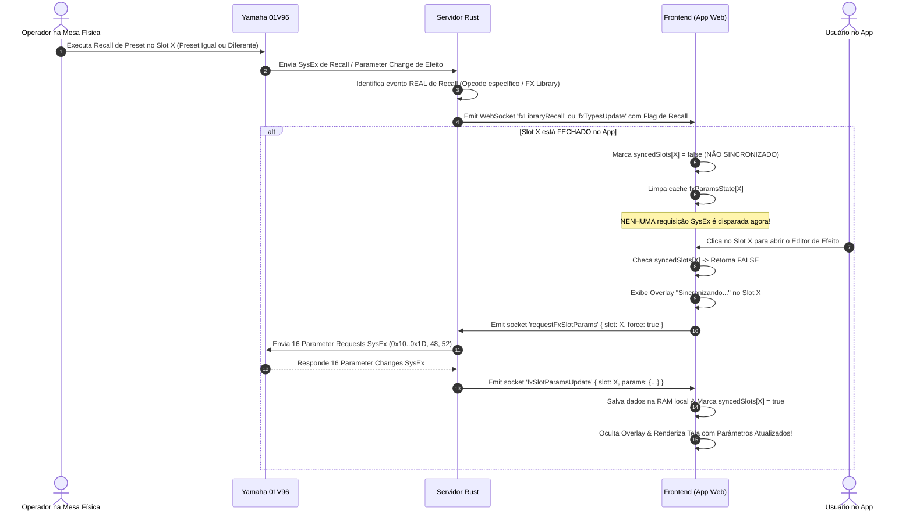
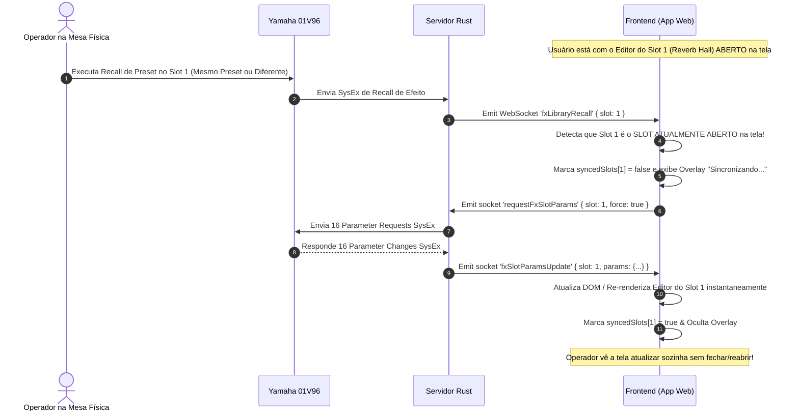
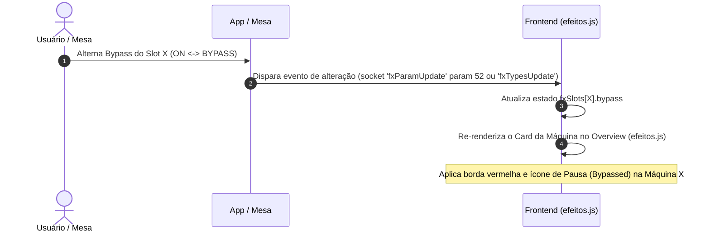
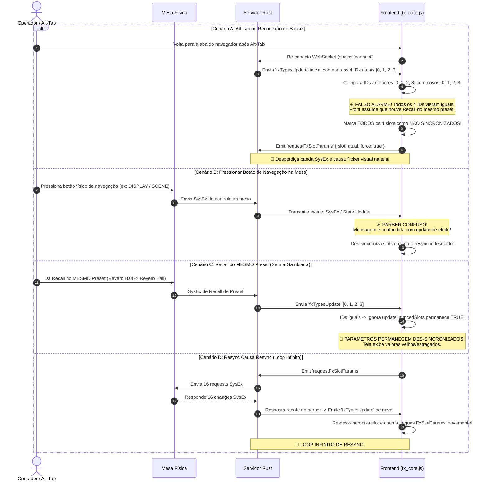

# Documentação de Diagnóstico: Problemas e Fluxos de Sincronização de Efeitos (Yamaha 01V96)

---

## 1. Prompt Original do Usuário

```text
agora que estamos atualizados, eu quero te explicar como eu espero que funcione o esquema das telas de efeitos.

sync inicial -> armazena na ram -> frontend tem sempre os dados mais atuais que são atualizados conforme manipulados pela mesa > app e vice versa -> frontend exibe

entro em um slot de FX X -> checa flags para ter certeza de que já não foi feita um sync daquele slot de fx -> lazy sync puxa dados da mesa 1 vez apenas -> armazena no state -> mesma lógica de sempre ir exibindo os dados atualizados conforme manipulados da mesa > app e vice versa SEM PRECISAR causar sync novamente quando abrir o mesmo slot pois ele já foi FLAGEADO como SINCRONIZADO, mesmo que eu dê refresh, essa flag é via servidor, então o foco aqui é: sincronizou 1 vez, não sincroniza mais, apenas atualiza os dados obtidos

porém temos uma condição que muda isso, semelhante ao recall de CENA que precisa ser feito um resync da cena completa, os efeitos possuem PRESETS, e ao dar recall neles, o front precisa de um resync nos eventos.

quando é dado recall em um preset existem duas etapas:

1: servidor detecta recall -> arma a flag do slot afetado como NÃO SINCRONIZADO -> operador abre aquele slot -> front checa flag -> resynca se aquele slot estiver como NÃO SINCRONIZADO

2: caso o slot afetado já esteja com a janela dele ABERTA, trigga o resync automaticamente SEM que o usuário precise fechar e abrir denovo aquela janela

aqui nesse ponto começam problemas onde o fx update da mesa é confundido com parametros de navegação, causando resync toda vez que um botão da mesa é pressionado. outro problema que pode acontecer é sincronizar e o próprio ato de sincronizar fazer o slot fi9car como NÃO SICNRONIZADO, causando resync e entrando em um loop onde o  resync causa um resync.

Esse é o ponto que menos dá problema, o problema real entra AQUI, onde imagine o cenário: operador da recall no preset padrão de reverb hall, começa a editar, mexe em tudo e não fica satisfeito com o resultado, então busca recomeçar do zero dando recall no MESMO preset. O que acontece? Como nossa checagem para indicar o slot que não está sincronizado é feito a partir da comparação do type atual com o novo, ele identifica que o mesmo e pula, mantendo como SINCRONIZADO. Sendo assim, nenhum slot é flagged e nenhum resync é armado para acontecer quando um slot é aberto, ou automaticamente quando um slot já está aberto.

Sendo assim, em certo ponto fizemos um esquema de detectar update da mesa, porém começou a cair naquele problema de qualquer botão da mesa, como navegaçãio por exemplo, ser tratado como update, triggando um resync.

A melhor maneira que eu imaginei, que é uma certa gambiarra mas deu certo, foi de toda vez que acontecer um update nos slots e acontecer a comparação slot por slot, se algum type der diferente, segue aquela lógica de flag somente aquele slot afetado como não sincronizado para resync automático se a tela ja estiver aberta daquele slot, ou apenas armá-lo para quando abrir a tela de efeitos, causar o resync do slot de efeito, certo? E quando der o update mas todos os slots derem como iguais? Aí que vem o pulo do gato número 1: marca TODOS como não sincronizados, assim como não temos como determinar qual slot foi afetado pois o type vai continuar o mesmo, marcamos TODOS como não sincronizados para obriga ro resync acontecer em todos. Uma gambiarra, mas funciona kkk Porém encontramos 2 problemas com isso, aquele loop maldito onde o resync causa resync, e um problema onde ao dar alt tab e a renderização parar (que foi o esquema que eu encontrei para diminuir o uso do aplicativo dos recursos de hardware visando pcs fracos) ao voltar, o front emite um socket connect que causa uma mensagem de update que causa um resync pois acaba retornando todos os types como iguais, triggando nossa nova lógica. Para isso tivemos que colocar um delay de  segundos para evitar nossa lógica de capturar essa mensagem de entender como um update REAL da mesa.

Se tivesse dado tudo certo teríamos 2 cenários:

operador NÃO está com o slot que vai manipular aberto na tela do app -> dá recall na MESA -> servidor intercepta update -> compara os slots atualizados -> se um deles está diferente = marca somente aquele slot para ser atualizado, se todos estão iguais = marca TODOS os slots para serem resync quando abertos -> operados abre a tela de efeitos -> state pega o novo type dos slots para mostrar o nome das maquinas de efeitos atualizados !!importante (pois atualmente por exemplo eu cliquei em bypass e não mudou o estado da maquina de efeitos que tem um efeito que quando bypass = on fica um contorno vermelho em volta da maquina e um icone de pausa para indicar que o efeito está bypassed) -> operador abre o slot afetado -> ou só ele foi marcado (caso preset = diferente do anterior) ou todos foram marcados para resync (caso preset = anterior) -> resync dos parametros é feito -> operador me os dados mais atualizados.

segundo cenário é tudo igual, porém o operador ESTÁ com a tela do efeito que vai ser maniupulado ABERTA e por isso ao dar recall, seja preset = anterior ou não, a tela aberta é identificada como aberta e é triggado um resync daquele efeito, a menos que o operador abriu o slot 1 e deu recall em um preset qualquer no slot 2 por exemplo, como não foi o mesmo slot, não vai resyncar, a não ser que no slot 2 ele deu recall em um preset = ao anterior do mesmo slot, aí como todos os slots vão ser flagged como não atualizados, o slot 1 aberto no momento, vai ser syncado.
```

---

## 2. Pontuação dos Pontos Colocados pelo Usuário

### 2.1. Premissas Fundamentais do Sistema de Efeitos
1. **Sincronização Inicial no Boot & RAM Server:**
   - O servidor lê a cena/mesa no boot e armazena o estado dos efeitos (Tipos, Mix, Bypass, Patch IN/OUT) em memória RAM (`GlobalState`).
   - O frontend reflete esse estado e recebe alterações pontuais de parâmetros (`Parameter Change` SysEx) bidirecionalmente (Mesa ↔ App) sem precisar re-sincronizar tudo a cada toque.
2. **Lazy-Sync por Slot (Single-Fetch Guarantee):**
   - Os 14+ parâmetros internos de cada slot de efeito (DECAY, INI DLY, DIFF, HPF, LPF, Gate, etc.) são puxados da mesa **apenas uma vez** quando o operador abre o modal do slot (`openFxEditor(slotIdx)`).
   - Após obter os dados, o slot é marcado como **SINCRONIZADO** (`syncedSlots[slot] = true`).
   - Enquanto estiver sincronizado, fechar e reabrir a tela do mesmo slot lê **diretamente da RAM** sem disparar nenhuma nova requisição SysEx à mesa física.
3. **Eventos de Recall de Presets/Bibliotecas (FX Library Recall):**
   - Semelhante a uma mudança de cena geral, um Recall de Preset de Efeito altera todos os 14+ parâmetros internos do slot na mesa de uma só vez.
   - Quando o operador faz um Recall na mesa física, o sistema precisa:
     - **Etapa 1 (Janela do Slot Fechada):** Marcar o slot afetado como **NÃO SINCRONIZADO** (`syncedSlots[slot] = false`). Na próxima vez que o usuário abrir a tela do slot, o Lazy-Sync roda automaticamente.
     - **Etapa 2 (Janela do Slot Aberta):** Se o slot afetado for o que está visível na tela no exato momento do Recall, o app spottar a mudança e disparar o resync **imediatamente e de forma transparente**, sem exigir que o operador feche e reabra o modal.

---

## 3. Mapeamento dos Problemas Identificados

### 🔴 Problema 1: Recall do MESMO Preset (Same-Type Recall) Não Flagga Des-sincronização
- **Sintoma:** Se o operador editar um Reverb Hall, estragar o som e der Recall no **mesmo** preset de Reverb Hall na mesa para resetar os parâmetros:
- **Causa Raiz:** A lógica antiga comparava apenas o `Effect Type ID` anterior com o novo. Como ambos continuam sendo `0` (Reverb Hall), o sistema considerava que nada mudou e mantinha o slot como `syncedSlots = true`.
- **Efeito:** Os parâmetros internos modificados continuavam mostrando os valores antigos/estragados na UI, sem disparar o resync dos parâmetros.

### 🔴 Problema 2: Gambiarra de "Tipos Iguais = Marca TODOS como Não Sincronizados"
- **Sintoma:** Para contornar o Problema 1, foi criada uma regra: "Se chegou um evento de `fxTypesUpdate` da mesa onde todos os 4 IDs são idênticos aos anteriores, marque TODOS os 4 slots como NÃO SINCRONIZADOS".
- **Efeitos Colaterais Gravíssimos:**
  1. **Loop de Resync Infinita (Resync Causa Resync):** Ao solicitar os parâmetros de um slot à mesa, a mesa responde com bytes de SysEx. Em certas situações, o parser da mesa/servidor ou o re-envio do estado interpretava a própria resposta da mesa como um evento de update geral, re-emitindo `fxTypesUpdate` com os mesmos IDs, o que des-sincronizava o slot novamente, disparando outro resync num loop infinito.
  2. **Reconexão de Socket no Alt-Tab (Falso Recall):** Quando o usuário dá Alt-Tab (ou diminui o foco do navegador para economizar CPU/RAM), o navegador pausa a renderização e o socket se desconecta/reconecta. Ao reconectar, o servidor re-envia o `fxTypesUpdate` inicial com os 4 tipos da mesa. O frontend recebia esses 4 tipos idênticos, interpretava como um "Recall do mesmo preset na mesa física" e des-sincronizava todos os slots, forçando resync indevido.

### 🔴 Problema 3: Botões Físicos de Navegação da Mesa Confundidos com Update de Efeito
- **Sintoma:** Pressionar botões de navegação, troca de tela ou chaves genéricas na mesa 01V96 gerava mensagens MIDI SysEx/CC que eram erroneamente interpretadas pelo parser como atualização de efeito, des-sincronizando os slots e gerando tráfego SysEx desnecessário.

### 🔴 Problema 4: Estado de Bypass e Visual no Overview da Tela de Efeitos Desincronizado
- **Sintoma:** Ao alternar o estado de Bypass de uma máquina de efeitos (seja pelo app ou pela mesa física), a visualização da máquina de efeitos no modal de visão geral (`efeitosModal`) não atualizava dinamicamente a borda vermelha e o ícone de pausa (`bypassed`), pois o estado de Bypass no card da máquina dependia de uma releitura completa ou de evento não propagado corretamente para o card do overview.

---

## 4. Diagrama e Fluxo Desejado (Como DEVE Funcionar)

### 4.1. Fluxo Desejado: Cenário 1 — Slot FECHADO no App quando ocorre Recall na Mesa



---

### 4.2. Fluxo Desejado: Cenário 2 — Slot ABERTO no App quando ocorre Recall na Mesa



---

### 4.3. Fluxo Desejado: Atualização Visual de Bypass na Tela de Overview



---

## 5. Diagrama e Fluxo ATUAL (Problemático — Como Está Agora)



---

## 6. Resumo das Regras de Ouro Solicitadas para a Solução Definitiva

1. **Separação Rígida de Eventos:**
   - Respostas de requisição de parâmetros de efeito (respostas do `0x30`) NUNCA podem ser re-interpretadas como um evento de `fxTypesUpdate` ou `fxLibraryRecall`.
   - Botões de navegação/controle da mesa NUNCA podem des-sincronizar slots de efeito.
2. **Tratamento Explicito de Recall de Preset no Servidor (`fxLibraryRecall`):**
   - Em vez de depender do frontend tentar adivinhar se houve Recall comparando array de IDs no `fxTypesUpdate`, o **Servidor Rust** deve detectar o SysEx real de Recall de Biblioteca de Efeitos (`0D 04 09...` / `7F 10...`) e emitir um evento Socket explícito e dedicado: `fxLibraryRecall` especificando exatamente qual `slot` sofreu o Recall.
3. **Resync Direcionado pelo Evento Explícito de Recall:**
   - Ao receber `fxLibraryRecall { slot }`:
     - Se o modal do slot afetado estiver **ABERTO**, resynca o slot **IMEDIATAMENTE**.
     - Se o modal do slot afetado estiver **FECHADO**, apenas des-sincroniza o slot (`syncedSlots[slot] = false`) para resyncar quando o operador abri-lo.
4. **Proteção Contra Reconexão de Socket (Alt-Tab Safe):**
   - O payload inicial transmitido no evento `connect` do WebSocket serve unicamente para popular os nomes/IDs na UI e NUNCA deve invalidar os `syncedSlots` locais nem forçar resyncs indesejados.
5. **Atualização Visual do Bypass no Overview (`efeitos.js`):**
   - A alteração do estado de Bypass (`param 52`) deve atualizar em tempo real o card do processador no overview dos 4 slots, ativando/desativando a borda vermelha e o ícone indicativo de pausa.

---

## 7. Captura Real do Fluxo de Recall do Preset 3 no Slot 4 (MIDI SysEx Log)

Abaixo está a captura real de tráfego MIDI capturada na porta física da Yamaha 01V96 durante o procedimento de **Recall do Preset 3 no Slot 4**:

```text
📊 Y→S: 3444 | S→Y: 0 | 📶 Meters: 3444 | 🔁 Loopback filtrado: 3444
[21:18:51] 🎹 Y→S (14b): F0 43 10 3E 0D 04 09 04 00 00 00 00 00 F7
[21:18:51] 💻 S→Y (14b): F0 43 10 3E 0D 04 09 04 00 00 00 00 00 F7
[21:18:51] 🎹 Y→S (12b): F0 43 10 3E 7F 10 04 00 03 00 03 F7
[21:18:51] 💻 S→Y (12b): F0 43 10 3E 7F 10 04 00 03 00 03 F7
[21:18:52] 🎹 Y→S (14b): F0 43 10 3E 0D 04 09 04 00 00 00 00 00 F7
[21:18:52] 💻 S→Y (14b): F0 43 10 3E 0D 04 09 04 00 00 00 00 00 F7
[21:18:52] 🎹 Y→S (14b): F0 43 10 3E 0D 04 09 04 00 00 00 00 00 F7
[21:18:52] 💻 S→Y (14b): F0 43 10 3E 0D 04 09 04 00 00 00 00 00 F7
[21:18:52] 🎹 Y→S (14b): F0 43 10 3E 0D 04 09 04 00 00 00 00 00 F7
[21:18:52] 💻 S→Y (14b): F0 43 10 3E 0D 04 09 04 00 00 00 00 00 F7
[21:18:52] 🎹 Y→S (15b): F0 43 10 3E 7F 50 04 00 03 00 00 00 00 00 F7
[21:18:52] 💻 S→Y (15b): F0 43 10 3E 7F 50 04 00 03 00 00 00 00 00 F7
[21:18:52] 🎹 Y→S (14b): F0 43 10 3E 0D 04 09 04 00 00 00 00 00 F7
[21:18:52] 💻 S→Y (14b): F0 43 10 3E 0D 04 09 04 00 00 00 00 00 F7
[21:18:52] 🎹 Y→S (14b): F0 43 10 3E 0D 04 09 04 00 00 00 00 00 F7
[21:18:52] 💻 S→Y (14b): F0 43 10 3E 0D 04 09 04 00 00 00 00 00 F7
[21:18:53] 🎹 Y→S (14b): F0 43 10 3E 7F 01 58 31 00 00 00 00 12 F7
[21:18:53] 💻 S→Y (14b): F0 43 10 3E 7F 01 58 31 00 00 00 00 12 F7
[21:18:53] 🎹 Y→S (14b): F0 43 10 3E 7F 01 58 31 01 00 00 00 31 F7
[21:18:53] 💻 S→Y (14b): F0 43 10 3E 7F 01 58 31 01 00 00 00 31 F7
[21:18:53] 🎹 Y→S (14b): F0 43 10 3E 7F 01 58 31 02 00 00 00 02 F7
[21:18:53] 💻 S→Y (14b): F0 43 10 3E 7F 01 58 31 02 00 00 00 02 F7
[21:18:53] 🎹 Y→S (14b): F0 43 10 3E 7F 01 58 31 03 00 00 00 02 F7
[21:18:53] 💻 S→Y (14b): F0 43 10 3E 7F 01 58 31 03 00 00 00 02 F7
📊 Y→S: 3453 | S→Y: 12 | 📶 Meters: 3441 | <ctrl42> Loopback filtrado: 3441
```

### Análise Técnica da Sequência SysEx Capta:

1. **Assinatura do Recall de Preset de Efeito (Opcode `0x10` na Seção `0x7F`):**
   ```text
   F0 43 10 3E 7F 10 04 00 03 00 03 F7
   ```
   - `0x7F`: Seção de Efeitos (`kEffect`).
   - `0x10`: Opcode de **Recall de Preset**.
   - `0x04`: Slot afetado (Slot FX4 - índice 3 / 0x04).
   - `0x03`: Número do Preset selecionado (Preset 3).
   - **Conclusão:** Este byte `7F 10 [SLOT] 00 [PRESET]` é o gatilho perfeito e inquestionável para o servidor Rust saber exatamente qual slot sofreu o Recall na mesa, eliminando qualquer adivinhação no frontend.

2. **Notificação de Nome/Título do Preset (Opcode `0x50` na Seção `0x7F`):**
   ```text
   F0 43 10 3E 7F 50 04 00 03 ... F7
   ```
   - Atualiza a identificação da biblioteca de efeitos no slot `0x04`.

3. **Broadcast em Lote dos Effect Types (Parâmetro `0x31` no Element `0x58`):**
   ```text
   F0 43 10 3E 7F 01 58 31 00 00 00 00 12 F7  (FX1 -> Type 18 / 0x12)
   F0 43 10 3E 7F 01 58 31 01 00 00 00 31 F7  (FX2 -> Type 49 / 0x31)
   F0 43 10 3E 7F 01 58 31 02 00 00 00 02 F7  (FX3 -> Type 2  / 0x02)
   F0 43 10 3E 7F 01 58 31 03 00 00 00 02 F7  (FX4 -> Type 2  / 0x02)
   ```
   - A mesa re-envia o `Effect Type` dos 4 slots. Como o parser no servidor responderá diretamente ao evento `7F 10` (Item 1), o broadcast dos types idênticos não causará falsos alarmes de resync.

